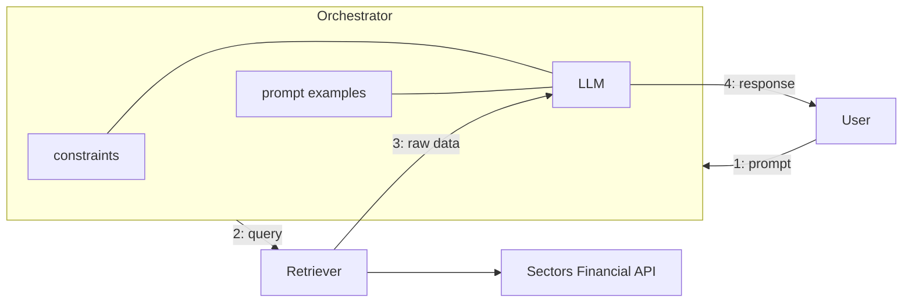

# Recipe 01 — Generative AI for Finance

> Source: https://docs.sectors.app/recipes/generative-ai-python/01-background (verified 2026-08-29).
> By: [Samuel Chan](https://www.github.com/onlyphantom) · August 1, 2024.
>
> Part 1 of 6 in the **Generative AI Python** series. The series builds LLM-
> powered financial agents on top of the Sectors Financial API. Links to
> sibling recipes:
>
> - [Recipe 02 — Tool-use RAG](02-tool-use-rag.md)
> - [Recipe 03 — Multi-agent workflows](03-multiagent.md)
> - [Recipe 04 — Structured output](04-structured-output.md)
> - [Recipe 05 — Tool-use ReAct agents with streaming](05-react-conversational.md)
> - [Recipe 06 — Conversational memory agents](06-memory-agents.md)

## Goal of this recipe

Understand *why* general-purpose LLMs fail on financial questions, and
*what architecture* (retrieval-augmented generation) fixes the failure mode.
By the end of this recipe you should be able to:

- Explain the four limitations of general-purpose LLMs for finance.
- Describe the three components of a RAG system (orchestrator, retriever, LLM).
- Decide when to use RAG vs. incremental training vs. domain-specific LLMs.

This recipe is **conceptual** — there is no runnable code. Code begins in
[Recipe 02](02-tool-use-rag.md).

---

## Architecture diagram

Three components:

1. **Orchestrator** (LangChain, custom Python, or any agent framework) —
   owns the user interaction, decides which retrieval strategy to use, and
   feeds retrieved data to the LLM.
2. **Retriever** — wraps an external data source as a function or tool. In
   this series, every retriever hits the Sectors Financial API. Can be plain
   keyword search, semantic search, or API-backed.
3. **LLM** — generates the final response. The orchestrator constrains it
   (via system prompts and tool schemas) so the response is grounded in
   retrieved data, not the LLM's training cutoff.

---

## Inputs / outputs

This recipe has no code, but conceptually:

- **Input**: any natural-language financial question (e.g. *"What is BBCA's
  market cap?"* or *"Compare P/E ratios of the top 3 banks."*).
- **Output**: a factually grounded natural-language response, plus the
  chain of retrieval calls the LLM made to produce it.

---

## Why general-purpose LLMs are not enough for finance

A bare LLM (think ChatGPT 3.5 / 4 with no retrieval hookup) fails in finance
for **four** distinct reasons. The recipe lists them all; they are worth
memorising because each one has a different fix.

### 1. Stale training data

> "LLM training data tends to be out-of-date (ChatGPT's knowledge cutoff is
> on January 2022)."

A general-purpose LLM cannot tell you BBCA's current market cap because its
training data ended months or years ago. Fix: RAG — fetch current data from
the Sectors API at query time.

### 2. Confident hallucination

> "LLMs extrapolate with generic information when facts aren't available,
> confidently making false but plausible-sounding statements when there's a
> gap in their knowledge."

A LLM without retrieval will invent numbers that *look* right. Fix: RAG
forces the LLM to cite only data that was actually retrieved, and to
acknowledge gaps when the retriever returns empty.

### 3. Confidentiality / data residency

> "Incorporation of actual financial data in the training process might be
> limited due to confidentiality concerns, and the model's ability to
> interact with uploaded financial data also poses a security risk."

You cannot paste proprietary financials into a public LLM API. Fix: keep
data on your side of the wall and pass *retrieved excerpts* (not raw files)
to the LLM as context.

### 4. Terminology confusion

> "Generating inaccurate responses due to terminology confusion (we'll see
> an example below regarding the abbreviation 'p.e'), or presenting generic
> information where users expect financial-specific, current information."

Ask ChatGPT 4o "What does P.E. stand for?" and it returns five candidate
expansions — *Physical Education, Professional Engineer, Private Equity,
Public Enemy, Post Edition*. A finance-domain LLM or RAG system returns the
correct single answer: **Price-to-Earnings Ratio**. Fix: ground the LLM in
finance-specific context (system prompt + retrieved financial data).

---

## Three approaches to fix the four problems

| Approach                              | Strengths                              | Weaknesses                                          |
| ------------------------------------- | -------------------------------------- | --------------------------------------------------- |
| **Incremental training** (fine-tune a base LLM on finance data) | Specialised output, less hallucination | Expensive, rigid, requires continual retraining     |
| **Domain-specific LLM** (BloombergGPT) | Built for finance vocabulary           | Very expensive to train, narrow, hard to maintain   |
| **Retrieval-Augmented Generation (RAG)** | Up-to-date, controllable, cheap to update | Requires a reliable, pre-built knowledge store    |

> "Successful implementation of RAG requires a reliable, up-to-date and
> often-times pre-determined knowledge store that can be queried by the
> model. RAG can also be considered task-specific in that is functionally
> specialized to the knowledge store it is paired with, and might not offer
> the breadth of functionality as a domain-specific finance LLM."
>
> — Samuel Chan, *Generative AI for Finance*

**Verdict**: for the hackathon, RAG wins on cost, time-to-build, and the
ability to ground every claim in a real Sectors API call. The next four
recipes are all variants of RAG.

---

## API-based RAG systems

The recipe's architecture diagram is reproduced above. In summary:

- The orchestrator connects the user to the retriever and the LLM.
- The orchestrator is responsible for taking the user's input, determining
  the appropriate retrieval strategy, and passing the query to the retriever.
- The retriever then retrieves the relevant information from Sectors
  financial data layer, and passes this information back to the LLM for
  response generation.

The advantages of API-based RAG over text-to-SQL or fine-tuning:

- Up-to-date financial data, directly from the database
- Secured access to financial data, compared to pushing data over to a
  public LLM
- Ability to control the information that the LLM has access to compared to
  a text-to-sql LLM model
- Avoid the risk of hallucination or overly generic response with no
  financial context or specificity
- Avoid prompt hijacking or other adversarial attacks that commonly exploit a
  general-purpose LLM's prompt system

When using a framework such as LangChain, the orchestrator can be configured
with a variety of RAG-specific prompting strategies as well as different
Large Language Models in a fairly modular, plug-and-play fashion.

---

## Hackathon applicability

This recipe is conceptual but maps to all three tracks:

| Track                  | How RAG applies                                                |
| ---------------------- | -------------------------------------------------------------- |
| **AI agents**          | Foundation for every agent pattern in recipes 02–06.           |
| **Automation**         | Schedule RAG queries via cron instead of user-triggered chat.  |
| **Market intelligence** | Combine RAG with report-generation tools to produce briefings. |

For the **AI agents** track specifically, this recipe is the prerequisite for
every following recipe — read it first, then jump to recipe 02 to start
building.

---

## Pitfalls

- **Don't fine-tune just because RAG feels hacky**. RAG is the right answer
  for *most* finance use cases. Fine-tuning wins when you have a very narrow,
  well-defined task and the budget to maintain it. For hackathon-scale
  builds, start with RAG and add fine-tuning only if you measure a gap.
- **Don't rely on the LLM's knowledge cutoff**. Always cite a retrieved
  source. The user should never have to wonder "is this 2022 or current?".
- **Don't expose raw data to the LLM**. Pass small, structured excerpts
  (single company reports, single quarterly snapshots). The LLM should not
  see the entire IDX universe — it's expensive and noisy.
- **Don't assume the LLM knows finance acronyms**. Force the system prompt
  to define domain terms. The recipe's example: "P.E. = Price-to-Earnings
  Ratio". Add a glossary for ticker conventions (`BBCA.JK`, `D05.SI`, etc).

---

## Next steps

- [Recipe 02 — Tool-use RAG](02-tool-use-rag.md) — first runnable code.
  Wraps three Sectors API endpoints as LangChain tools and orchestrates them
  with `AgentExecutor`.
- [Recipe 03 — Multi-agent workflows](03-multiagent.md) — splits the single
  agent into specialized agents with a judge-critic loop.
- [Recipe 04 — Structured output](04-structured-output.md) — adds Pydantic
  schemas so the LLM returns typed objects instead of strings.
- [Recipe 05 — Tool-use ReAct with streaming](05-react-conversational.md) —
  modernises recipe 02 with LangGraph's prebuilt ReAct agent + streaming.
- [Recipe 06 — Conversational memory](06-memory-agents.md) — adds per-user
  message history with `RunnableWithMessageHistory`.
- [`../mcp/`](../mcp/) — the MCP tool catalog this series assumes you have
  connected.
