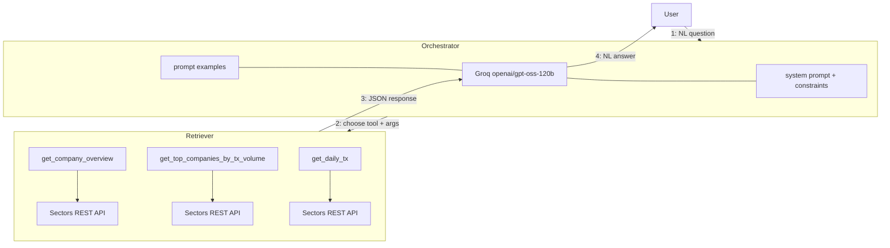

# Recipe 02 — Tool-Use RAG with Sectors

> Source: https://docs.sectors.app/recipes/generative-ai-python/02-tool-use (verified 2026-08-29).
> By: [Samuel Chan](https://www.github.com/onlyphantom) · August 1, 2024.
>
> Part 2 of 6 in the **Generative AI Python** series.
>
> - [Recipe 01 — Generative AI for Finance](01-generative-ai-bg.md) (prereq)
> - [Recipe 03 — Multi-agent workflows](03-multiagent.md)
> - [Recipe 04 — Structured output](04-structured-output.md)
> - [Recipe 05 — Tool-use ReAct agents with streaming](05-react-conversational.md)
> - [Recipe 06 — Conversational memory agents](06-memory-agents.md)

## Goal

Build a working **tool-use RAG** system that answers natural-language
financial queries about IDX stocks by retrieving data from the Sectors
Financial API. Three thin Python tools wrap three Sectors REST endpoints,
then a LangChain `AgentExecutor` orchestrates them with a Groq-hosted LLM.

By the end you will have:

- Three LangChain `@tool`-decorated functions (`get_company_overview`,
  `get_top_companies_by_tx_volume`, `get_daily_tx`).
- A `ChatGroq` LLM (`openai/gpt-oss-120b`, was `llama3-groq-70b-8192-tool-use-preview`)
  with tool-calling enabled.
- An `AgentExecutor` that takes natural-language questions and dispatches to
  the right tool.

---

## Architecture diagram



---

## Step-by-step code walkthrough

### 1. Install dependencies

```bash
pip install requests
pip install langchain
pip install langchain-groq
```

### 2. Set up API keys

```bash
# .env
GROQ_API_KEY=your_groq_api_key
SECTORS_API_KEY=your_sectors_api_key
```

> Note: REST auth is `Authorization: <raw_key>` — **no `Bearer` prefix**.
> If you're using the MCP server instead, the prefix is required. See
> [`../mcp/setup.md`](../mcp/setup.md) §"REST vs MCP".

### 3. Helper: a single retrieval function

```python
import os, json, requests
from dotenv import load_dotenv

load_dotenv()
GROQ_API_KEY = os.getenv("GROQ_API_KEY")
SECTORS_API_KEY = os.getenv("SECTORS_API_KEY")


def retrieve_from_endpoint(url: str) -> dict:
    headers = {"Authorization": SECTORS_API_KEY}

    try:
        response = requests.get(url, headers=headers)
        response.raise_for_status()
        data = response.json()
    except requests.exceptions.HTTPError as err:
        raise SystemExit(err)
    return json.dumps(data)
```

> This is just a convenience wrapper. It centralises auth, error handling,
> and JSON conversion so the tool definitions stay short.

### 4. Define three tools

```python
from langchain_core.tools import tool

@tool
def get_company_overview(stock: str) -> str:
    """Get company overview."""
    url = f"https://api.sectors.app/v2/company/report/{stock}/?sections=overview"
    return retrieve_from_endpoint(url)

@tool
def get_top_companies_by_tx_volume(
    start_date: str, end_date: str, top_n: int = 5
) -> str:
    """Get top companies by transaction volume."""
    url = f"https://api.sectors.app/v2/most-traded/?start={start_date}&end={end_date}&n_stock={top_n}"
    return retrieve_from_endpoint(url)

@tool
def get_daily_tx(stock: str, start_date: str, end_date: str) -> str:
    """Get daily transaction for a stock."""
    url = f"https://api.sectors.app/v2/daily/{stock}/?start={start_date}&end={end_date}"
    return retrieve_from_endpoint(url)


tools = [
    get_company_overview,
    get_top_companies_by_tx_volume,
    get_daily_tx,
]
```

> **Equivalent MCP tools** (see [`../mcp/tools.md`](../mcp/tools.md)):
> - `get_company_overview` → `fetch-company-report(symbol, sections="overview")`
> - `get_top_companies_by_tx_volume` → `fetch-most-traded-stocks(start, end, n_stock)`
> - `get_daily_tx` → `fetch-daily-transaction(symbol, start, end)`

### 5. Wire up the LLM

```python
from langchain_core.prompts import ChatPromptTemplate, MessagesPlaceholder
from langchain_groq import ChatGroq
from langchain_classic.agents import create_tool_calling_agent, AgentExecutor

prompt = ChatPromptTemplate.from_messages(
    [
        (
            "system",
            """Answer the following queries, being as factual and analytical
            as you can. If you need the start and end dates but they are not
            explicitly provided, infer from the query. Whenever you return a
            list of names, return also the corresponding values for each name.
            If the volume was about a single day, the start and end
            parameter should be the same.""",
        ),
        ("human", "{input}"),
        MessagesPlaceholder("agent_scratchpad"),
    ]
)

llm = ChatGroq(
    temperature=0,
    model_name="openai/gpt-oss-120b",   # was llama3-groq-70b-8192-tool-use-preview
    groq_api_key=GROQ_API_KEY,
)

agent = create_tool_calling_agent(llm, tools, prompt)
agent_executor = AgentExecutor(agent=agent, tools=tools, verbose=True)
```

> **Model swap (2026-03-02)**: the original `llama3-groq-70b-8192-tool-use-preview`
> is no longer available. The recipe was updated to `openai/gpt-oss-120b`.
> See [Groq Models](https://console.groq.com/docs/models) for the current
> tool-capable lineup: `llama-3.1-405b-reasoning`, `llama-3.1-70b-versatile`,
> `llama-3.1-8b-instant`, `gemma2-9b-it`, etc.

### 6. Run a query

```python
queries = [
    "What are the top 3 companies by transaction volume over the last 7 days?",
    "Based on the closing prices of BBCA between 1st and 30th of June 2024, are we seeing an uptrend or downtrend? Try to explain why.",
    "What is the company with the largest market cap between BBCA and BREN? For said company, retrieve the email, phone number, listing date and website for further research.",
    "What is the performance of GOTO (symbol: GOTO) since its IPO listing?",
    "If i had invested into GOTO vs BREN on their respective IPO listing date, which one would have given me a better return over a 90 day horizon?",
]

for query in queries:
    print("Question:", query)
    result = agent_executor.invoke({"input": query})
    print("Answer:", "\n", result["output"], "\n\n======\n\n")
```

The first three queries work with the three tools defined above. Queries 4
and 5 require an additional tool for IPO performance — see the recipe's
[Improvement Ideas section](#improvement-ideas).

---

## Inputs / outputs

- **Input**: free-form natural-language query about IDX-listed companies.
- **Output**: natural-language answer, plus (with `verbose=True`) a trace of
  every tool call and response.

Example output for `query_1` ("top 3 by transaction volume over the last 7
days"):

```
> Entering new AgentExecutor chain...
Invoking: `get_top_companies_by_tx_volume` with `{'start_date': '2024-07-24', 'end_date': '2024-07-31', 'top_n': 3}`

{"2024-07-24": [{"symbol": "GOTO.JK", ...}, ...]}

> Finished chain.

Answer:
The top 3 companies by transaction volume over the last 7 days are
PT GoTo Gojek Tokopedia Tbk, PT Wulandari Bangun Laksana Tbk, and
PT Era Media Sejahtera Tbk.
```

---

## Improvement ideas (from the source)

The recipe suggests five concrete ways to extend the basic RAG:

1. **Add more tools** — news, analyst reports, social sentiment per stock.
2. **Better prompts** — experiment with system prompts that guide tone,
   format (markdown tables?), and inference rules.
3. **More descriptive tools** — richer docstrings help the LLM pick the
   right tool. The orchestrator reads the tool's docstring to decide what
   each tool does.
4. **Different LLMs** — try other Groq tool-capable models, or swap to
   OpenAI / Anthropic for comparison.
5. **Error handling** — when the LLM fails to interpret the query, prompt
   the user for clarification instead of returning a wrong answer.

For the IPO performance queries (`query_4`, `query_5`), wrap
`fetch-listing-performance` as a fourth tool:

```python
@tool
def get_performance_since_ipo(stock: str) -> str:
    """Get price performance since IPO listing across 7d, 30d, 90d, 365d windows."""
    url = f"https://api.sectors.app/v2/ipo/listing-performance/{stock}/"
    return retrieve_from_endpoint(url)
```

---

## Hackathon applicability

| Track                  | How this recipe applies                                         |
| ---------------------- | --------------------------------------------------------------- |
| **AI agents**          | The minimal viable agent — start here for any AI agent track build. |
| **Automation**         | Replace the chat loop with a cron loop: `agent_executor.invoke(...)` → write results to DB or post to a webhook. |
| **Market intelligence** | Wrap each tool as a function-calling endpoint your BI dashboard polls. |

---

## Pitfalls

- **Don't paste your REST API key with `Bearer`**. REST uses raw key, no
  prefix. If you copy-paste from the MCP setup, you'll get HTTP 401s.
- **Don't include `.JK` in tickers**. The API normalises internally, but
  some agents occasionally pass through the suffix and trip edge cases. The
  MCP guide explicitly strips it — match that convention here too.
- **Don't skip the `verbose=True` flag during development**. Without it, you
  can't see which tool the agent picked or why. Once stable, set `verbose=False`
  for production.
- **Don't assume the LLM infers dates correctly**. The system prompt nudges
  it to infer "last 7 days" → `[today-7, today]`, but for absolute dates
  ("on June 30 2024"), pass them explicitly in the user prompt.
- **Don't return huge payloads to the LLM**. `get_company_overview` already
  takes a `sections` filter — use `sections=overview` instead of requesting
  the full report. Same for the REST API. Each extra section costs credits
  AND adds noise to the LLM context.

---

## Next steps

- [Recipe 03 — Multi-agent workflows](03-multiagent.md) — split into
  Screener / Researcher / Evaluator agents with a self-improving loop.
- [Recipe 04 — Structured output](04-structured-output.md) — add Pydantic
  schemas so the LLM returns typed objects, not strings.
- [Recipe 05 — Tool-use ReAct with streaming](05-react-conversational.md) —
  modern stack (LangGraph `create_react_agent` + streaming).
- [Recipe 06 — Conversational memory](06-memory-agents.md) — per-user
  message history.
- [`../mcp/tools.md`](../mcp/tools.md) — full Sectors MCP tool catalog with
  equivalent REST endpoints.
