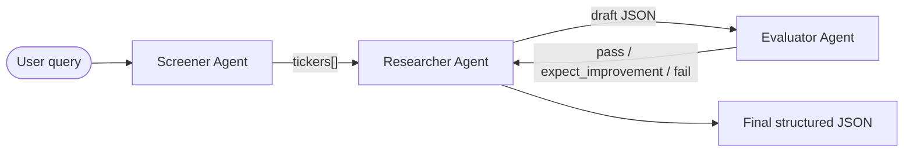

# Recipe 03 — Multi-Agent Workflows for Financial Research

> Source: https://docs.sectors.app/recipes/generative-ai-python/03-multiagent-workflows (verified 2026-08-29).
> By: [Billy Samuel](https://github.com/billysams21) and [Andreas Christianto](https://github.com/AndreChristianto) · March 5, 2026.
>
> Part 3 of 6 in the **Generative AI Python** series.
>
> - [Recipe 02 — Tool-use RAG](02-tool-use-rag.md) (prereq)
> - [Recipe 04 — Structured output](04-structured-output.md)
> - [Recipe 05 — Tool-use ReAct agents with streaming](05-react-conversational.md)
> - [Recipe 06 — Conversational memory agents](06-memory-agents.md)

## Goal

Decompose a complex financial research task into **specialised agents** that
each do one thing well, then orchestrate them with two patterns:

1. **Sequential chain** — output of one agent feeds the next.
2. **Judge-critic** — a third agent grades the output and demands revisions
   if it falls short.

By the end you will have a 3-agent pipeline (Screener → Researcher →
Evaluator) that produces high-quality structured output and self-corrects on
the first attempt.

---

## Architecture diagram



Three agents:

- **IDX Screener** (gpt-4o-mini) — calls the Sectors screener and returns a
  clean list of tickers. Narrow, fast, single tool.
- **IDX Researcher** (gpt-4o) — receives the tickers, calls
  `get_company_overview` for each, returns structured JSON with all metric
  fields populated.
- **Evaluator** (gpt-4o-mini) — receives the draft, checks each result has
  required fields with non-null values, and grades the output as
  `pass` / `expect_improvement` / `fail`.

If the Evaluator says anything other than `pass`, the Researcher is re-prompted
with the feedback up to 3 times. This is the **judge-critic loop**.

---

## Step-by-step code walkthrough

### 1. Install dependencies

```bash
pip install openai-agents
```

The recipe uses the [OpenAI Agents SDK](https://pypi.org/project/openai-agents/)
(`from agents import Agent, Runner, function_tool`).

### 2. Define the tools

```python
import os, json, requests
from dotenv import load_dotenv

load_dotenv()

SECTORS_API_KEY = os.getenv("SECTORS_API_KEY")
os.environ["OPENAI_API_KEY"] = os.getenv("OPENAI_API_KEY")

HEADERS = {"Authorization": SECTORS_API_KEY}

@function_tool
def find_companies_screener(order_by: str, limit: int, where: str = "") -> str:
    """Screen and rank IDX companies via Sectors v2 API."""
    # URL-encode to handle special chars in filter expressions like >, <
    params = [f"order_by={requests.utils.quote(order_by)}", f"limit={limit}"]
    if where:
        params.insert(0, f"where={requests.utils.quote(where.strip())}")

    url = f"https://api.sectors.app/v2/companies/?" + "&".join(params)
    response = requests.get(url, headers=HEADERS)
    return json.dumps(response.json())

@function_tool
def get_company_overview(ticker: str) -> str:
    """Get company overview and financials for an IDX ticker."""
    url = f"https://api.sectors.app/v2/company/report/{ticker}/?sections=overview,financials"
    response = requests.get(url, headers=HEADERS)
    return json.dumps(response.json())
```

> **Equivalent MCP tools** (see [`../mcp/tools.md`](../mcp/tools.md)):
> - `find_companies_screener` → `fetch-companies-by-subsector(q, where, order_by, limit)`
> - `get_company_overview` → `fetch-company-report(symbol, sections="overview,financials")`

### 3. Define three agents

```python
from typing import Literal
from dataclasses import dataclass
from agents import Agent

screener_agent = Agent(
    name="IDX Screener",
    instructions=(
        "You screen the Indonesia Stock Exchange (IDX) by calling the appropriate tool. "
        "Return ONLY a Python list of clean ticker symbols without the .JK suffix. "
        "Example: ['BBCA', 'BBRI', 'TLKM']"
    ),
    tools=[find_companies_screener],
    model="gpt-4o-mini"
)

researcher_agent = Agent(
    name="IDX Researcher",
    instructions=(
        "You are a financial researcher. You receive a user query and a list of IDX tickers. "
        "Call get_company_overview for every ticker to gather data. "
        "Return ONLY a raw JSON object containing 'metric_fields' and a 'results' array. "
        "Do not use markdown fences."
    ),
    tools=[get_company_overview],
    model="gpt-4o"
)

@dataclass
class EvaluationFeedback:
    feedback: str
    score: Literal["pass", "expect_improvement", "fail"]

evaluator_agent = Agent(
    name="Evaluator",
    instructions=(
        "Grade the provided JSON object. Check that: "
        "1. Every result has a 'ticker' and 'company_name'. "
        "2. The metric fields contain non-null numeric values. "
        "Score 'pass' if all checks pass, otherwise 'expect_improvement' or 'fail'."
    ),
    model="gpt-4o-mini",
    output_type=EvaluationFeedback
)
```

> Notice the **deliberate model split**: Screener and Evaluator use the
> cheaper `gpt-4o-mini` (call them many times, simple tasks), Researcher
> uses the full `gpt-4o` (called once per ticker, complex synthesis).
> Cost optimisation: cheap agents on the hot path, expensive agents only
> where reasoning depth matters.

### 4. Orchestrate the workflow

```python
import asyncio
from agents import Runner

async def main():
    query = "Top 5 IDX banks by market cap"

    # Sequential chain: screener -> researcher
    screener_resp = await Runner.run(screener_agent, query)
    tickers = screener_resp.final_output
    print(f"Tickers found: {tickers}")

    research_input = f"User query: '{query}'\nTickers: {tickers}"
    research_resp = await Runner.run(researcher_agent, research_input)
    current_draft = research_resp.final_output

    # Judge-critic loop: evaluator grades, researcher revises
    final_output = None
    max_attempts = 3

    for attempt in range(1, max_attempts + 1):
        print(f"Evaluating draft (Attempt {attempt}/{max_attempts})...")
        eval_resp = await Runner.run(evaluator_agent, current_draft)

        feedback_obj = eval_resp.final_output_as(EvaluationFeedback)

        if feedback_obj.score == "pass":
            final_output = current_draft
            break

        print(f"Revision needed. Feedback: {feedback_obj.feedback}")
        revision_input = (
            f"User query: '{query}'\nTickers: {tickers}\n"
            f"Previous output graded '{feedback_obj.score}'.\n"
            f"Feedback: {feedback_obj.feedback}\n"
            "Fix the issues and return the corrected JSON object."
        )
        research_resp = await Runner.run(researcher_agent, revision_input)
        current_draft = research_resp.final_output

    if not final_output:
        final_output = current_draft  # best-effort fallback

    print("Final Output:")
    print(final_output)


if __name__ == "__main__":
    asyncio.run(main())
```

### 5. Visualise the output

The structured JSON output flows directly into pandas / matplotlib / seaborn
— no manual data wrangling:

```python
import matplotlib.pyplot as plt
import seaborn as sns
import pandas as pd

def display_summary_table(data_json):
    """Display a summary table from JSON data"""
    data = json.loads(data_json) if isinstance(data_json, str) else data_json
    df = pd.DataFrame(data['results'])

    if 'market_cap' in df.columns:
        df['market_cap_billions'] = (df['market_cap'] / 1_000_000_000).round(2)

    print("\n" + "="*80)
    print("Company Analysis Summary")
    print("="*80)
    print(df.to_string(index=False))
    print("="*80 + "\n")

def create_bar_chart(data_json, title="Market Cap Comparison",
                     x_col='ticker', y_col='market_cap'):
    """Create and display a bar chart"""
    data = json.loads(data_json) if isinstance(data_json, str) else data_json
    df = pd.DataFrame(data['results'])

    plt.figure(figsize=(10, 6))
    sns.set_theme(style="whitegrid")

    x_data = df[x_col] if x_col in df.columns else df.index
    y_data = df[y_col]

    ax = sns.barplot(x=x_data, y=y_data, palette='viridis', hue=x_data, legend=False)
    ax.set_title(title, fontweight='bold', fontsize=14)
    ax.set_xlabel('Bank Ticker', fontsize=12)
    ax.set_ylabel('Market Cap (IDR)', fontsize=12)

    for i, v in enumerate(y_data):
        ax.text(i, v + max(y_data) * 0.01, f'{v/1e12:.2f}T',
                ha='center', va='bottom', fontsize=10)

    plt.tight_layout()
    plt.show()


# After the workflow completes:
display_summary_table(final_output)
create_bar_chart(final_output, title="Top 5 IDX Banks by Market Cap")
```

Sample output for `"Top 5 IDX banks by market cap"`:

```
Tickers found: ['BBCA', 'BBRI', 'BMRI', 'BBNI', 'BRIS']

Final Output:
{
  "metric_fields": ["ticker", "company_name", "market_cap", "listing_date", "sector"],
  "results": [
    {"ticker": "BBCA", "company_name": "PT Bank Central Asia Tbk.",
     "market_cap": 1263500995330048, "listing_date": "2000-05-31", "sector": "Financials"},
    ...
  ]
}
```

If the Evaluator finds an issue:

```
Evaluating draft (Attempt 1/3)...
Revision needed. Feedback: Missing 'company_name' field in result index 2.
Please ensure all results include ticker and company_name.

Evaluating draft (Attempt 2/3)...
Final Output:
{ ...all fields present... }
```

---

## Inputs / outputs

- **Input**: any natural-language screening query (e.g. "Top 5 banks by
  market cap", "IDX mining stocks with P/E < 10", "Companies in software
  subsector").
- **Output**: structured JSON `{metric_fields, results}` ready for pandas
  / matplotlib / a downstream API call.

---

## Why this is better than a single agent

> "But what happens when a task is too complex for a single agent to handle
> reliably? As queries become more complex or require multiple reasoning
> steps, even a well-designed single agent can struggle with reliability and
> accuracy."
>
> "Instead of relying on one agent to juggle multiple responsibilities, we
> can decompose complex tasks into specialized sub-agents, each focused on
> doing one thing exceptionally well. Think of it as moving from a solo
> performer to an orchestra—each instrument (agent) plays its part, and
> together they create something more robust and reliable than any single
> performer could achieve alone."
>
> — Billy Samuel & Andreas Christianto

The two patterns combine cleanly:

- **Sequential chain** — specialisation + parallelisable streaming of
  intermediate results. Each agent's instructions are narrow and
  debuggable.
- **Judge-critic** — self-improving loop. If the Researcher ever drops a
  field or returns malformed JSON, the Evaluator catches it before the user
  sees garbage.

---

## Hackathon applicability

| Track                  | How this recipe applies                                         |
| ---------------------- | --------------------------------------------------------------- |
| **AI agents**          | This is the canonical "production-quality" agent template. Add your own screener + researcher + critic for any finance sub-task. |
| **Automation**         | Replace `query` with a list of cron-driven screens. The Evaluator doubles as a quality gate before posting to Slack/Telegram. |
| **Market intelligence** | Each agent becomes a step in a daily briefing pipeline (screen → research → grade → publish). |

---

## Pitfalls

- **Don't make agents too specialised**. Three narrow agents beats one
  mega-prompt, but ten narrow agents adds coordination overhead. Aim for
  3–5 agents per workflow.
- **Don't use the same model for every agent**. The cheap/fast model on
  routine tasks (screener, evaluator) + the expensive/smart model on
  synthesis (researcher) is the right shape. Using gpt-4o on the Evaluator
  burns budget for no quality gain.
- **Don't skip the `final_output_as(...)` cast**. The Evaluator's raw output
  is still a string; you need `EvaluationFeedback` to access `.score` and
  `.feedback` as typed fields.
- **Don't set `max_attempts` too high**. Three attempts is the sweet spot —
  beyond that, the Researcher is unlikely to fix a fundamental prompt issue
  and you waste tokens. If three attempts fail, fix the prompt.
- **Don't forget to fall back to the last draft**. If `max_attempts` is
  exhausted without a `pass`, return the most recent draft anyway. Better
  imperfect data than a crash.

---

## Extension: data-rich visualisation

The recipe ends with a pandas/seaborn dashboard. For the hackathon, swap
matplotlib for whatever visualisation fits your track:

- **Track AI agents** — render the JSON as a Streamlit or Gradio page
  showing one chart per metric.
- **Track automation** — convert to CSV, push to Google Sheets via the
  Sheets API (see [`../mcp/setup.md`](../mcp/setup.md) for the auth header
  pattern; Sheets uses a similar `Authorization: Bearer` flow).
- **Track market intelligence** — run the screener across all 47 banks
  daily, render the top-10 movers as a heatmap, post to Slack.

---

## Next steps

- [Recipe 04 — Structured output](04-structured-output.md) — replace the
  `instructions=...` JSON contract with a Pydantic schema so the output is
  validated, not just instructed.
- [Recipe 05 — Tool-use ReAct with streaming](05-react-conversational.md)
  — modern stack with LangGraph prebuilt agents.
- [Recipe 06 — Conversational memory](06-memory-agents.md) — add per-user
  message history.
- [`../mcp/tools.md`](../mcp/tools.md) — full Sectors MCP tool catalog.
