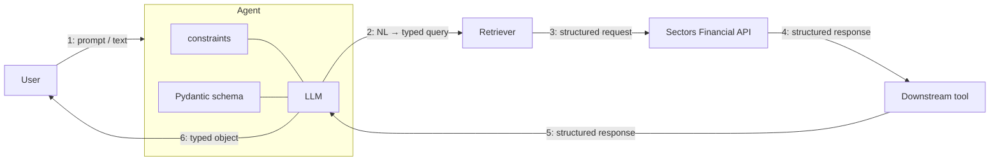

# Recipe 04 — Structured Output from LLMs

> Source: https://docs.sectors.app/recipes/generative-ai-python/04-structured-output (verified 2026-08-29).
> By: [Samuel Chan](https://www.github.com/onlyphantom) · October 1, 2024.
> Written using LangChain 0.3.0 (released September 14, 2024).
>
> Part 4 of 6 in the **Generative AI Python** series.
>
> - [Recipe 02 — Tool-use RAG](02-tool-use-rag.md) (prereq)
> - [Recipe 03 — Multi-agent workflows](03-multiagent.md)
> - [Recipe 05 — Tool-use ReAct agents with streaming](05-react-conversational.md)
> - [Recipe 06 — Conversational memory agents](06-memory-agents.md)

## Goal

Force an LLM to return **typed objects** instead of strings. Once your
agent pipeline produces JSON that conforms to a schema, every downstream
tool — database insert, report render, Slack post, webhook — can trust the
shape without manual parsing.

By the end you will have:

- A Pydantic `Stock` model with field-level validators.
- A LangChain `ChatGroq` LLM bound to that schema via
  `.with_structured_output(Stock)`.
- A fallback path using `PydanticOutputParser` and `SimpleJsonOutputParser`
  for models that don't support `response_format=json_object`.
- A small reusable `FinalResponse` union pattern for schemas that may return
  *either* a list of stocks *or* a conversational reply.

---

## Architecture diagram



Two important concepts:

- **Tool schemas** (the contracts the LLM sees when picking which tool to
  call) — covered in [Recipe 02](02-tool-use-rag.md).
- **Output schemas** (the contract the LLM's final response must match) —
  the topic of this recipe.

Both are needed: tool schemas make sure the LLM calls the right REST
endpoint with the right arguments; output schemas make sure what comes back
fits the next stage of the pipeline.

---

## Step-by-step code walkthrough

### 1. Install dependencies

```bash
pip install requests langchain langchain-groq
```

### 2. Define a Pydantic schema

```python
from typing import Optional
from pydantic import BaseModel, Field

class Stock(BaseModel):
    """Information about a company's stock"""

    symbol: str = Field(description="The stock symbol")
    name: str = Field(description="The name of the company for which the stock symbol represents")
    sector: Optional[str] = Field(default=None, description="The sector of the company")
    industry: Optional[str] = Field(default=None, description="The industry of the company")
    market_cap: Optional[int] = Field(default=None, description="The market capitalization of the company")
```

> **Why the docstrings matter**: `with_structured_output` reads the Pydantic
> class name, docstring, field names, and field descriptions and passes them
> to the LLM as if they were part of the system prompt. Treat the schema as
> a *spec* — clear descriptions = better structured output.

### 3. Bind the schema to the LLM

```python
import os
from dotenv import load_dotenv
from langchain_groq import ChatGroq

load_dotenv()
GROQ_API_KEY = os.getenv("GROQ_API_KEY")

llm = ChatGroq(
    temperature=0,
    model_name="openai/gpt-oss-120b",   # was llama3-groq-70b-8192-tool-use-preview
    groq_api_key=GROQ_API_KEY,
)

structured_llm = llm.with_structured_output(Stock)
```

### 4. Extract from unstructured text

```python
text = """
    Bank Central Asia (BCA) is a bank in Indonesia and is part of the finance sector.
    It is in the banking industry and has a market capitalization of $85 billion.
    It trades under the symbol BBCA on the Indonesia Stock Exchange.
"""

out = structured_llm.invoke(text)
print(out)
# Stock(symbol='BBCA', name='Bank Central Asia', sector='finance', industry='banking', market_cap=85000000000)
```

> The `market_cap` field is `85000000000` — the LLM parsed "$85 billion" and
> converted to raw integer. If your downstream code expects the unit-prefixed
> form, add a `Field(..., description="...in raw IDR, not billions")` hint.

### 5. Generate from a prompt

```python
create = """
    Create a fictitious company called Supertype Inc. that is in the
    technology sector and has a market capitalization of $10 million.
    It trades under the symbol SUPA.
"""

generated = structured_llm.invoke(create)
print(generated)
# Stock(symbol='SUPA', name='Supertype Inc.', sector='technology', industry=None, market_cap=10000000)
```

---

## LCEL: chaining with the LangChain Expression Language

`langchain` v0.3+ replaces `LLMChain` with LCEL pipe-syntax. The pipe `|`
operator composes functions into a `RunnableSequence`:

```python
from langchain_openai import ChatOpenAI
from langchain_core.prompts import ChatPromptTemplate

model = ChatOpenAI()
prompt = ChatPromptTemplate.from_template("give me information for the stock: {symbol}")

chain = prompt | model

chain.invoke({"symbol": "BBCA"})
# {"symbol": "BBCA.JK", "company_name": "PT Bank Central Asia Tbk.",
#  "overview": {"listing_board": "Main", "industry": "Banks", ...}}
```

Three operators worth knowing:

| Operator / method | Purpose                                       |
| ----------------- | --------------------------------------------- |
| `\|`              | Compose functions into a runnable sequence    |
| `.invoke()`       | Single-shot execution                         |
| `.batch()`        | Run against a list of inputs in parallel      |
| `.stream()`       | Return an iterable for token-by-token output  |

```python
chain.batch([{"symbol": "BBCA"}, {"symbol": "BBRI"}])

for s in chain.stream({"symbol": "BMRI"}):
    print(s.content, end="")
```

---

## Multi-schema responses: union types

When the LLM might return *either* a list of stocks *or* a conversational
reply ("how are you?"), define a `FinalResponse` union schema:

```python
from typing import List, Union
from pydantic import BaseModel, Field

class Stock(BaseModel):
    """Information about a company's stock"""
    symbol: str = Field(description="The stock symbol")
    name: str = Field(description="The name of the company for which the stock symbol represents")
    sector: Optional[str] = Field(default=None, description="The sector of the company")
    industry: Optional[str] = Field(default=None, description="The industry of the company")
    market_cap: Optional[int] = Field(default=None, description="The market capitalization of the company")

class Stocks(BaseModel):
    """Extracted data about stocks"""
    stocks: List[Stock]

class ConversationalResponse(BaseModel):
    """Respond in a conversation manner. Be nice and sweet."""
    response: str = Field(description="A helpful response to the user's query")

class FinalResponse(BaseModel):
    """Final response to the user's query"""
    output: Union[Stocks, ConversationalResponse]

prompt = ChatPromptTemplate.from_messages(
    [
        (
            "system",
            "You are an expert extraction algorithm. "
            "Extract relevant information from the text. "
            "If you do not know the value of an attribute asked to extract, "
            "return null for the attribute's value.",
        ),
        ("human", "{text}"),
    ]
)

runnable = prompt | llm.with_structured_output(schema=FinalResponse)
```

Sample invocation:

```python
text = """
    Bank Central Asia (BCA) is a bank in Indonesia and is part of the finance sector.
    It is in the banking industry and has a market capitalization of $85 billion.
    It trades under the symbol BBCA on the Indonesia Stock Exchange.

    Bank Rakyat Indonesia (BRI) is the oldest bank in Indonesia, tracing back since 1895.
    It has a market capital of $52 billion and is an important player in the country's finance sector.
    It trades as BBRI on the Indonesia Stock Exchange.
"""

out = runnable.invoke({"text": text})
out_list = list(out.output.stocks)

print(out_list[0])
# Stock(symbol='BBCA', name='Bank Central Asia', sector='finance', industry='banking', market_cap=85000000000)

print(out_list[1])
# Stock(symbol='BBRI', name='Bank Rakyat Indonesia', sector='finance', industry='banking', market_cap=52000000000)
```

The same runnable handles chit-chat too:

```python
generic = runnable.invoke({"text": "how are you this evening?"})
print(generic.output)
# response="I'm doing well, thank you for asking. How can I assist you further this evening?"
```

---

## Output parsers (alternative approach)

`with_structured_output` requires the LLM provider to support
`response_format=json_object` (or equivalent). When the provider doesn't, or
when you want explicit Pydantic validation, use `PydanticOutputParser`.

### `PydanticOutputParser` with model_validator

```python
from pydantic import BaseModel, Field, model_validator
from langchain_core.output_parsers import PydanticOutputParser
from langchain_core.prompts import PromptTemplate

class Stock(BaseModel):
    """Information about a company's stock"""

    symbol: str = Field(description="The stock symbol")
    name: str = Field(description="The name of the company for which the stock symbol represents")
    sector: Optional[str] = Field(default=None, description="The sector of the company")
    industry: Optional[str] = Field(default=None, description="The industry of the company")
    market_cap: Optional[int] = Field(default=None, description="The market capitalization of the company")

    @model_validator(mode="before")
    @classmethod
    def validate_symbol_4_letters(cls, values: dict) -> dict:
        symbol = values["symbol"]

        if len(symbol) != 4:
            raise ValueError("Symbol must be 4 letters long")
        return values

    @model_validator(mode="before")
    @classmethod
    def validate_market_cap(cls, values: dict) -> dict:
        market_cap = values["market_cap"]

        if market_cap < 0:
            raise ValueError("Market cap must be a positive number")
        return values

parser = PydanticOutputParser(pydantic_object=Stock)
prompt = PromptTemplate(
    template="Answer the user query.\n{format_instructions}\n{query}\n",
    input_variables=["query"],
    partial_variables={"format_instructions": parser.get_format_instructions()},
)

runnable = prompt | llm | parser
result = runnable.invoke({"query": "Create a fictional company ... "})
```

The two `model_validator`s run on every invocation — if the LLM returns a
negative `market_cap` or a 3-character `symbol`, the parser raises
`ValueError` before downstream tools see bad data.

### `SimpleJsonOutputParser` (no validation, just JSON shape)

For cases where you don't need strict validation but want structured JSON:

```python
from langchain_core.output_parsers.json import SimpleJsonOutputParser

class Stock(BaseModel):
    """Information about a company's stock"""
    symbol: str = Field(description="The stock symbol")
    name: str = Field(description="The name of the company for which the stock symbol represents")
    sector: Optional[str] = Field(default=None, description="The sector of the company")
    industry: Optional[str] = Field(default=None, description="The industry of the company")
    market_cap: Optional[int] = Field(default=None, description="The market capitalization of the company")

class Data(BaseModel):
    """Extracted data about stocks"""
    stocks: List[Stock]
    followup_question: Optional[str] = Field(
        default=None, description="A follow-up question to ask the user"
    )

llm = ChatGroq(
    temperature=0,
    model_name="openai/gpt-oss-120b",
    groq_api_key=GROQ_API_KEY,
    model_kwargs={"response_format": {"type": "json_object"}},
)

prompt = PromptTemplate.from_template(
    """
    Extract relevant information from the text. For the followup_question key,
    generate a follow-up question to ask the user.
    Return a JSON object with the keys 'stocks' and 'followup_question'
    satisfying the user query: {text}
    """
)

runnable = prompt | llm | SimpleJsonOutputParser()
```

> **Caveat**: `SimpleJsonOutputParser` does *not* validate the schema. If
> the LLM invents fields or returns wrong types, the output will silently
> propagate. Use `PydanticOutputParser` (or `with_structured_output`) when
> correctness matters.

---

## Inputs / outputs

- **Input**: any prompt or unstructured text the LLM should structure.
- **Output**: a Python object conforming to the Pydantic schema, ready for
  downstream tools (DB inserts, report generation, JSON-schema-validated
  APIs).

---

## Why schema-aware systems beat string parsing

In an automated trading pipeline or financial reporting tool, the output of
one tool is often the *input* to another. If the first tool returns a string
and the second tool parses it manually:

- Every schema change requires updating both tools.
- A subtle format difference (extra spaces, missing comma) breaks the
  pipeline silently.
- You can't auto-generate API docs, OpenAPI specs, or database migrations.

With Pydantic schemas throughout:

- The schema is the contract. Change the schema, every consumer sees the new
  shape via static type checking.
- Validation runs at every boundary (LLM output, API response, DB row).
- Schemas serialize cleanly to JSON Schema, which downstream OpenAPI tools,
  GraphQL servers, and database ORMs understand.

---

## Hackathon applicability

| Track                  | How this recipe applies                                         |
| ---------------------- | --------------------------------------------------------------- |
| **AI agents**          | Every tool-call result becomes a typed object. Combine with [recipe 03](03-multiagent.md) for the full pipeline. |
| **Automation**         | Cron job calls the agent, gets typed JSON, writes directly to your DB or webhook. |
| **Market intelligence** | Stream the LLM output as JSON to a charting frontend. No parsing needed. |

---

## Pitfalls

- **Don't trust `Optional` fields to actually be populated**. The LLM may
  return `None` even when the source text contains the value. Add explicit
  validators if a field is downstream-critical.
- **Don't skip the model-validator challenge**. The recipe's challenge
  (`test_parser.py` to assert that a negative `market_cap` raises
  `ValueError`) is the difference between "works on the happy path" and
  "production-safe". Write the test.
- **Don't use `SimpleJsonOutputParser` when `PydanticOutputParser` would
  do**. The latter enforces your schema; the former only enforces
  "valid-JSON".
- **Don't hardcode `model_kwargs={"response_format": ...}`** for providers
  that don't support it. Use `with_structured_output` instead — it
  negotiates with the provider.
- **Don't forget to convert units**. The LLM often parses "$85 billion"
  into `85000000000`, but downstream tools might expect
  `85000000.0` (in millions) or `"85B"`. Spell out the unit in the field
  description.

---

## Challenge (from the source)

Write a `test_parser.py` that asserts the parser raises `ValueError` for a
negative market cap:

```python
def test_output_parser_mcap():
    text = """
    Bank Central Asia (BCA) is a bank in Indonesia and is part of the finance sector.
    It is in the banking industry and has a market capitalization of $-8.5 billion.
    """
    # expect parser.invoke(...) to raise ValueError
```

Use `pytest` or `unittest`. This is the **only test in the recipe series**
that explicitly verifies a defensive behaviour — write it. It's the kind of
unit test that catches a whole class of "silent wrong number" bugs in
production.

---

## Next steps

- [Recipe 05 — Tool-use ReAct with streaming](05-react-conversational.md)
  — modernise the agent stack with LangGraph `create_react_agent` and add
  streaming output.
- [Recipe 06 — Conversational memory](06-memory-agents.md) — add per-user
  message history so the agent follows up on prior context.
- [`../mcp/tools.md`](../mcp/tools.md) — full Sectors MCP tool catalog with
  the equivalent REST endpoints for every tool your schemas wrap.
