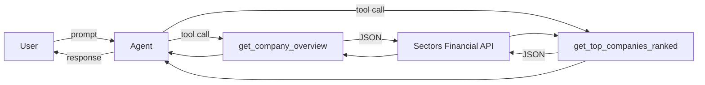
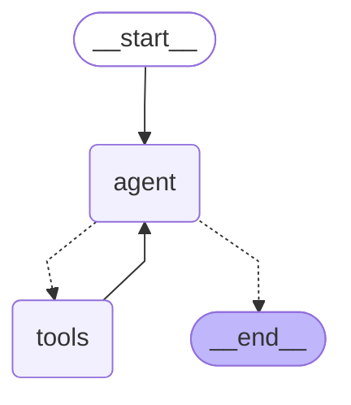

# Recipe 05 — Tool-Use ReAct Agents with Streaming

> Source: https://docs.sectors.app/recipes/generative-ai-python/05-conversational (verified 2026-08-29).
> By: [Samuel Chan](https://www.github.com/onlyphantom) · October 10, 2024.
> Updated for LangChain 0.3.2.
>
> Part 5 of 6 in the **Generative AI Python** series.
>
> - [Recipe 02 — Tool-use RAG](02-tool-use-rag.md) (prereq — covers `AgentExecutor`)
> - [Recipe 03 — Multi-agent workflows](03-multiagent.md)
> - [Recipe 04 — Structured output](04-structured-output.md)
> - [Recipe 06 — Conversational memory agents](06-memory-agents.md)

## Goal

Modernise the recipe 02 agent stack with **LangGraph's prebuilt ReAct agent**
and add **streaming output** so the user sees tokens as they arrive instead of
waiting for the full response. By the end you will have:

- A `create_react_agent` graph (the LangChain-recommended replacement for
  `AgentExecutor`).
- A `state_modifier` system prompt that constrains the agent's behaviour.
- A `query_app` helper that wraps `.invoke()` with a uniform interface.
- A streaming variant using `app.stream(...)` for real-time UX.
- A streaming-JSON variant using `JsonOutputParser` so JSON output streams
  cleanly without parse errors on partial output.

---

## Architecture diagram



The prebuilt ReAct graph from LangGraph has a tight loop:



The agent node calls the LLM, the tools node executes tool calls, and the
graph loops back to the agent until the LLM decides the task is done.

---

## Step-by-step code walkthrough

### 1. Install dependencies

```bash
pip install requests langchain langchain-groq langgraph
```

### 2. Set up the retrieval utility (same as recipe 02)

```python
import os, json, requests
from dotenv import load_dotenv

load_dotenv()
GROQ_API_KEY = os.getenv("GROQ_API_KEY")
SECTORS_API_KEY = os.getenv("SECTORS_API_KEY")


def retrieve_from_endpoint(url: str) -> dict:
    headers = {"Authorization": SECTORS_API_KEY}

    try:
        response = requests.get(url, headers=headers)
        response.raise_for_status()
        data = response.json()
    except requests.exceptions.HTTPError as err:
        raise SystemExit(err)
    return json.dumps(data)
```

> REST auth is raw key (no `Bearer`). For MCP, use
> `Authorization: Bearer <key>`. See [`../mcp/setup.md`](../mcp/setup.md)
> §"REST vs MCP".

### 3. Define the tools

```python
from langchain_core.tools import tool
from typing import List

@tool
def get_company_overview(stock: str) -> dict:
    """Get company overview.

    @param stock: The stock symbol of the company
    @return: The company overview
    """
    url = f"https://api.sectors.app/v2/company/report/{stock}/?sections=overview"
    return retrieve_from_endpoint(url)


@tool
def get_top_companies_ranked(dimension: str) -> List[dict]:
    """Return a list of top companies (symbol and company_name) ranked by a dimension.

    @param dimension: The dimension to rank companies by.
        - Static metrics: market_cap, dividend_yield_avg, pe_ttm, etc.
        - Time-specific metrics require [year] format: revenue[2024], earnings[2023], etc.
        Examples: "market_cap", "dividend_yield_avg", "revenue[2024]", "earnings[2023]"
    @return: A list of top tickers ranked by the specified dimension
    """
    url = f"https://api.sectors.app/v2/companies/?order_by=-{dimension}"

    response_data = json.loads(retrieve_from_endpoint(url))
    results = response_data.get('results', response_data)

    return json.dumps(results)
```

> **Equivalent MCP tools** (see [`../mcp/tools.md`](../mcp/tools.md)):
> - `get_company_overview` → `fetch-company-report(symbol, sections="overview")`
> - `get_top_companies_ranked` → `fetch-companies-by-subsector(q, order_by=...)`

Test the tools directly first:

```python
out = get_company_overview.invoke({"stock": "BBRI"})
print(out)
# {"symbol": "BBRI.JK", "company_name": "PT Bank Rakyat Indonesia (Persero) Tbk", ...}

out2 = get_top_companies_ranked.invoke({"dimension": "dividend_yield_avg"})
print(out2)
# [{"symbol": "SCPI.JK", "company_name": "PT Organon Pharma Indonesia Tbk"}, ...]
```

### 4. Create the ReAct agent

```python
from langchain_groq import ChatGroq
from langchain_core.prompts import ChatPromptTemplate
from langgraph.prebuilt import create_react_agent

llm = ChatGroq(
    temperature=0,
    model_name="openai/gpt-oss-120b",   # was llama3-groq-70b-8192-tool-use-preview
    groq_api_key=GROQ_API_KEY,
)

tools = [get_company_overview, get_top_companies_ranked]

system_message = """
You are an expert tool calling agent meant for financial data retriever and summarization.
Use tools to get the information you need. If you do not know the answer to a question, say so.
Whenever possible, answer with markdown-formatted code.
When ranking companies by time-specific financial metrics (revenue, earnings, etc.),
use the format 'metric[year]' (e.g., 'revenue[2024]', 'earnings[2023]').
For static metrics like market_cap or dividend_yield_avg, use them as-is.
"""

app = create_react_agent(llm, tools, state_modifier=system_message)
```

The `state_modifier` is the modern replacement for the
`ChatPromptTemplate(system=...)` pattern in recipe 02 — it injects a system
message into every turn without manually wiring `MessagesPlaceholder`.

### 5. Query the agent

```python
from langchain_core.messages import HumanMessage

def query_app(text: str) -> str:
    out = app.invoke(
        {
            "messages": [
                HumanMessage(text),
            ]
        }
    )
    return out["messages"][-1].content


# Natural-language query
print(query_app("Give me an overview of BBRI"))
# PT Bank Rakyat Indonesia (Persero) Tbk, listed as BBRI.JK, is a bank operating in
# the financial sector, specifically in the banks sub-industry. It is headquartered at
# Gedung BRI I Lantai 20, Jl. Jenderal Sudirman Kav.44-46, Jakarta Pusat 10210.
# The company has a market capitalization of 741,808,095,100,928, ranking it 4th
# in the market. ...

print(query_app("Top 5 companies ranked by market cap, along with their full company name"))
# Here are the top 5 companies ranked by market cap:
# 1. **PT Bank Central Asia Tbk.** (BBCA.JK)
# 2. **PT Barito Renewables Energy Tbk.** (BREN.JK)
# 3. **PT Chandra Asri Pacific Tbk** (TPIA.JK)
# 4. **PT Bank Rakyat Indonesia (Persero) Tbk** (BBRI.JK)
# 5. **PT Bank Mandiri (Persero) Tbk** (BMRI.JK)

print(query_app("Top 5 companies by revenue in 2024"))
# 1. PT Bank Rakyat Indonesia (Persero) Tbk (BBRI.JK)
# 2. PT Bank Central Asia Tbk. (BBCA.JK)
# 3. PT Bank Mandiri (Persero) Tbk (BMRI.JK)
# 4. PT Astra International Tbk (ASII.JK)
# 5. PT Telkom Indonesia (Persero) Tbk (TLKM.JK)
```

---

## Streaming the response

`.invoke()` blocks until the full response is ready. For long-running
queries (multi-step ReAct loops, slow API calls), use `.stream()` to yield
chunks as the agent works:

```python
for chunk in app.stream(
    {
        "messages": [
            HumanMessage(content="Top 5 companies ranked by market cap")
        ]
    }
):
    print(chunk)
    print("# ----")
```

Sample streaming output (one chunk per state transition):

```python
{'agent': {'messages': [
    AIMessage(content='', tool_calls=[{'name': 'get_top_companies_ranked',
                                       'args': {'dimension': 'market_cap'}, ...}])
]}}

# ----
{'tools': {'messages': [
    ToolMessage(content='[{"symbol": "BBCA.JK", ...}, ...]',
               name='get_top_companies_ranked', ...)
]}}

# ----

{'agent': {'messages': [
    AIMessage(content='Here are the top 5 companies ranked by market cap:\n1. **PT Bank Central Asia Tbk.** (BBCA.JK)\n2. **PT Barito Renewables Energy Tbk.** (BREN.JK)\n...')
]}}
```

> **Tip**: when printing streaming chunks in a Python REPL or notebook, add
> `flush=True` to your `print()` calls — Python buffers stdout by default,
> which defeats the purpose of streaming.
>
> ```python
> print(chunk, flush=True)
> ```

### Streaming vs JSON: the partial-parse problem

Streaming + structured JSON looks incompatible at first: if you `json.loads`
a half-written object, it raises `JSONDecodeError`. The fix is to apply the
parser *to the stream itself* — `JsonOutputParser` auto-completes partial
JSON into a valid object on every chunk:

```python
from langchain_core.output_parsers import JsonOutputParser

model = ChatGroq(model="openai/gpt-oss-120b")
app2 = model | JsonOutputParser()


async def fetch_companies():
    max_companies = 10

    if max_companies > 0:
        async for chunk in app2.astream(
            "generate a list of companies in indonesia and their corresponding ticker in json format. "
            "Use a dict with an outer key of 'companies' which contain a list of companies. "
            "Each company should have the key 'name' and 'ticker'. Stop at 10 companies."
        ):
            print(chunk, flush=True)
            max_companies -= 1


import asyncio
asyncio.run(fetch_companies())
```

Observed streaming output (note how each chunk is a *valid* JSON object —
the parser auto-fills in-progress values):

```
{}
{'companies': []}
{'companies': [{}]}
{'companies': [{'name': ''}]}
{'companies': [{'name': 'PT'}]}
{'companies': [{'name': 'PT Bank'}]}
{'companies': [{'name': 'PT Bank Central'}]}
{'companies': [{'name': 'PT Bank Central Asia'}]}
{'companies': [{'name': 'PT Bank Central Asia Tbk'}]}
{'companies': [{'name': 'PT Bank Central Asia Tbk', 'ticker': ''}]}
{'companies': [{'name': 'PT Bank Central Asia Tbk', 'ticker': 'B'}]}
{'companies': [{'name': 'PT Bank Central Asia Tbk', 'ticker': 'BBC'}]}
{'companies': [{'name': 'PT Bank Central Asia Tbk', 'ticker': 'BBCA'}]}
...
```

> **Why this works**: `JsonOutputParser` is a `Runnable` that knows how to
> interpret partial JSON. The stream emits raw tokens; the parser handles
> the shape.

---

## Inputs / outputs

- **Input**: natural-language financial question.
- **Output**: natural-language answer (via `.invoke()`) OR
  token-by-token stream (via `.stream()` / `.astream()`).

For a chat interface (Gradio, Streamlit, custom WebSocket), wire `.stream()`
to a generator that yields chunks to the frontend. For a CLI / cron job,
use `.invoke()` and block.

---

## ReAct in 30 seconds

ReAct (Reasoning + Acting) interleaves thought and action in a single LLM
turn. From the paper:

> "We explore the use of LLMs to generate both reasoning traces and
> task-specific actions in an interleaved manner, allowing for greater
> synergy between the two: reasoning traces help the model induce, track,
> and update action plans as well as handle exceptions, while actions allow
> it to interface with external sources, such as knowledge bases or
> environments, to gather additional information. ReAct outperforms
> imitation and reinforcement learning methods by an absolute success rate
> of 34% and 10% respectively, while being prompted with only one or two
> in-context examples."
>
> — Yao et al., [ReAct: Synergizing Reasoning and Acting in Language Models](https://react-lm.github.io/)

LangGraph's `create_react_agent` implements this pattern out of the box —
the agent node generates a thought + tool call, the tools node executes
the tool, and the loop continues until the agent emits a final answer.

---

## Hackathon applicability

| Track                  | How this recipe applies                                         |
| ---------------------- | --------------------------------------------------------------- |
| **AI agents**          | The recommended production agent stack — use this instead of `AgentExecutor`. Streaming + ReAct + clean tool binding = chat-ready. |
| **Automation**         | Wrap `.invoke()` in a cron job. Streaming is irrelevant for batch jobs. |
| **Market intelligence** | Combine with [recipe 03](03-multiagent.md) for a multi-agent streaming dashboard. |

---

## Pitfalls

- **Don't keep using `AgentExecutor` for new builds**. The LangChain docs
  explicitly recommend `create_react_agent` since 0.3.x. `AgentExecutor`
  still works but is on the deprecation path.
- **Don't forget `state_modifier`**. The system message tells the LLM how
  to behave (e.g. "use `revenue[2024]` for time-specific metrics"). Without
  it, the LLM picks default behaviors that may not match Sectors API
  semantics.
- **Don't stream structured output without `JsonOutputParser`** — raw
  partial JSON will fail to parse. The parser auto-completes partial
  objects.
- **Don't use `flush=True` only in some prints**. Be consistent — if even one
  `print` doesn't flush, the buffer hides your streaming.
- **Don't use `model="llama3-groq-70b-8192-tool-use-preview"`** — it's no
  longer available. Use `openai/gpt-oss-120b` or another current
  tool-capable Groq model.

---

## Challenge (from the source)

Implement a ReAct-style agent using the code from this recipe, then:

1. Find the top 7 companies by P/E (lower is better for value investing).
2. Issue a second query to get the overview of the **fourth** company in the list.

Sample output (subject to date drift):

```
Top 7 companies based on P/E values:
1. ABM Investama Tbk (ABMM.JK)
2. PT Jasa Marga Tbk (JSMR.JK)
3. Pabrik Kertas Tjiwi Kimia Tbk (TKIM.JK)
4. Adaro Energy Indonesia Tbk (ADRO.JK)
5. Energi Mega Persada Tbk (ENRG.JK)
6. PT Jasa Marga Tbk (JSMR.JK)
7. Pabrik Kertas Tjiwi Kimia Tbk (TKIM.JK)
```

Submit your code + both query outputs to the [discussion thread](https://github.com/onlyphantom/llm-python/discussions/39).

---

## Next steps

- [Recipe 06 — Conversational memory](06-memory-agents.md) — add per-user
  message history so the agent handles follow-up questions across turns.
- [Recipe 03 — Multi-agent workflows](03-multiagent.md) — split this single
  agent into specialised agents with a judge-critic loop.
- [Recipe 04 — Structured output](04-structured-output.md) — force typed
  output instead of free-form strings.
- [`../mcp/tools.md`](../mcp/tools.md) — full Sectors MCP tool catalog.
