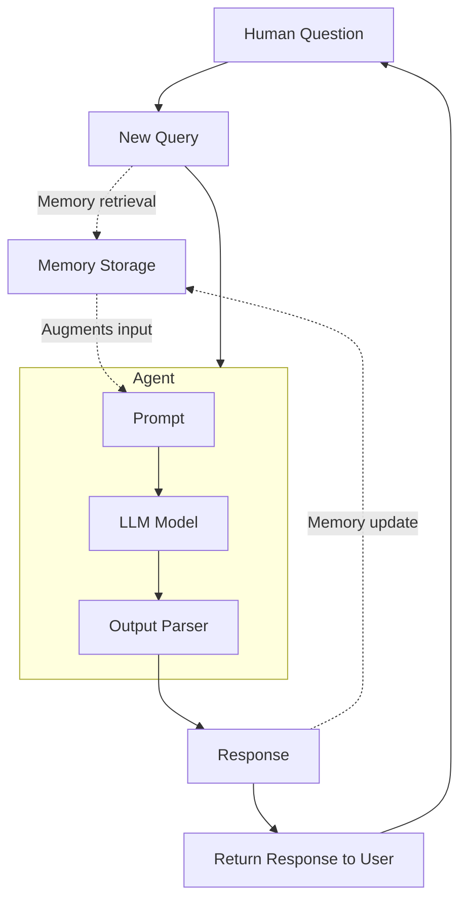

# Recipe 06 — Conversational Memory AI Agents

> Source: https://docs.sectors.app/recipes/generative-ai-python/06-memory-ai (verified 2026-08-29).
> By: [Samuel Chan](https://www.github.com/onlyphantom) · October 16, 2024.
> Updated for LangChain 0.3.2.
>
> Part 6 of 6 in the **Generative AI Python** series.
>
> - [Recipe 02 — Tool-use RAG](02-tool-use-rag.md) (prereq)
> - [Recipe 03 — Multi-agent workflows](03-multiagent.md)
> - [Recipe 04 — Structured output](04-structured-output.md)
> - [Recipe 05 — Tool-use ReAct agents with streaming](05-react-conversational.md)

## Goal

Make the agent **stateful** — remember the conversation history so
follow-up questions reference prior context ("Tell me more about the first
three" without repeating which company you meant). The recipe shows three
patterns:

1. **Legacy `ConversationChain` / `LLMChain`** with `ConversationBufferMemory`
   — for context, deprecated as of LangChain 0.3.x.
2. **`RunnableWithMessageHistory` + `InMemoryChatMessageHistory`** — the
   recommended approach for LangChain 0.3.2+. Per-session history keyed by
   `session_id`. Extend to user + conversation combos.
3. **`SQLChatMessageHistory`** — swap `InMemoryChatMessageHistory` for
   SQLite-backed persistence so history survives process restarts.
4. **Memory + ReAct agents** — `MemorySaver` checkpoint on a
   `create_react_agent` graph so tool-using agents stay stateful.

---

## Architecture diagram



Three interactions per turn:

1. **Memory retrieval** — the user's input is augmented with prior
   conversation history before going into the LLM.
2. **LLM generation** — the LLM sees the augmented prompt and produces a
   response.
3. **Memory update** — the LLM's response is appended to the memory store
   so future turns can reference it.

---

## Step-by-step code walkthrough

### 1. Install dependencies

```bash
pip install requests langchain langchain-groq langgraph
```

### 2. Set up the retrieval utility (same as recipes 02 / 05)

```python
import os, json, requests
from dotenv import load_dotenv

load_dotenv()
GROQ_API_KEY = os.getenv("GROQ_API_KEY")
SECTORS_API_KEY = os.getenv("SECTORS_API_KEY")


def retrieve_from_endpoint(url: str) -> dict:
    headers = {"Authorization": SECTORS_API_KEY}

    try:
        response = requests.get(url, headers=headers)
        response.raise_for_status()
        data = response.json()
    except requests.exceptions.HTTPError as err:
        raise SystemExit(err)
    return json.dumps(data)
```

### 3. Define the tool

```python
from langchain_core.tools import tool

@tool
def get_company_overview(stock: str) -> str:
    """Get company overview."""
    url = f"https://api.sectors.app/v2/company/report/{stock}/?sections=overview"
    return retrieve_from_endpoint(url)
```

> Equivalent MCP tool: `fetch-company-report(symbol, sections="overview")`
> — see [`../mcp/tools.md`](../mcp/tools.md).

---

## Pattern 1 — `RunnableWithMessageHistory` (recommended for 0.3.2+)

### Step 1: Build the runnable chain

```python
from langchain_groq import ChatGroq
from langchain_core.prompts import ChatPromptTemplate, MessagesPlaceholder

llm = ChatGroq(model="openai/gpt-oss-120b")

prompt = ChatPromptTemplate.from_messages(
    [
        (
            "system",
            "You're a financial stock advisor with adept knowledge of the Indonesian "
            "stock exchange (IDX) and adept at analysing, summarizing, inferring trends "
            "from financial information.",
        ),
        MessagesPlaceholder(variable_name="history"),
        ("human", "{question}"),
    ]
)

chain = prompt | llm
```

> Note the variable names: `history` and `question`. These MUST match the
> `input_messages_key` and `history_messages_key` arguments in
> `RunnableWithMessageHistory` below. Renaming requires updating both.

### Step 2: Wrap with `RunnableWithMessageHistory`

```python
from langchain_core.chat_history import InMemoryChatMessageHistory
from langchain_core.runnables.history import RunnableWithMessageHistory

store = {}

def get_session_history_by_id(session_id: str):
    if session_id not in store:
        store[session_id] = InMemoryChatMessageHistory()
    return store[session_id]

with_memory = RunnableWithMessageHistory(
    chain,
    get_session_history_by_id,
    input_messages_key="question",
    history_messages_key="history",
)
```

### Step 3: Invoke with a session_id

```python
out = with_memory.invoke(
    {"question": "What are some investable companies on the Indonesian stock market?"},
    config={"configurable": {"session_id": "supertype"}},
)
```

The agent responds with a list of investable IDX companies. The conversation
is now stored under `store["supertype"]`. A new `InMemoryChatMessageHistory`
object is created on first contact and reused for every subsequent call
with the same `session_id`.

### Step 4: Follow-up question that depends on memory

```python
out2 = with_memory.invoke(
    {"question": "Tell me more about the first three companies on the list"},
    config={"configurable": {"session_id": "supertype"}},
)
```

The LLM infers "the first three" from the prior turn's output. Without the
memory store, it would have no idea which three.

### Step 5: Different `session_id` = different conversations

```python
out3 = with_memory.invoke(
    {"question": "What was the second question i asked you?"},
    config={"configurable": {"session_id": "supertype"}},  # same session
)
# "Your second question was: 'Tell me more about the first three companies on the list'"

out4 = with_memory.invoke(
    {"question": "What was the second question i asked you?"},
    config={"configurable": {"session_id": "2"}},  # different session
)
# "I apologize, but this is the beginning of our conversation, and you haven't
# asked me any questions yet."
```

The `session_id` is the namespace boundary. Same id → shared history.
Different id → independent conversations.

### Step 6: Multi-key history (user_id + conversation_id)

For multi-tenant apps where users have multiple parallel conversations:

```python
from langchain_core.runnables import ConfigurableFieldSpec

def get_session_history_by_uid_and_convoid(user_id: str, conversation_id: str):
    concatenated = f"{user_id}_{conversation_id}"

    if concatenated not in store:
        store[concatenated] = InMemoryChatMessageHistory()
    return store[concatenated]

with_memory = RunnableWithMessageHistory(
    chain,
    get_session_history_by_uid_and_convoid,
    input_messages_key="input",
    history_messages_key="history",
    history_factory_config=[
        ConfigurableFieldSpec(
            id="user_id", annotation=str, name="User ID",
            description="Unique identifier for the user.", default="", is_shared=True,
        ),
        ConfigurableFieldSpec(
            id="conversation_id", annotation=str, name="Conversation ID",
            description="Unique identifier for the conversation.", default="", is_shared=True,
        ),
    ],
)
```

Now invoke with both ids:

```python
with_memory.invoke(
    ...,
    config={
        "configurable": {
            "user_id": "001",
            "conversation_id": "1",
        }
    },
)
```

User 001 + conversation 1 ≠ user 002 + conversation 1. Two distinct
conversations even though `conversation_id` matches.

### Step 7: Per-user context (holdings + language)

Inject additional per-user variables into the prompt template alongside
history:

```python
prompt = ChatPromptTemplate.from_messages(
    [
        (
            "system",
            """You're a bilingual financial stock advisor with adept knowledge of the
            Indonesian stock exchange (IDX). Answer the user's queries with respect
            to his stock holdings. Answer in the {language} language, but be casual
            and not too overly formal.
            The user's holdings are: {holdings}
            """,
        ),
        MessagesPlaceholder(variable_name="history"),
        ("human", "{input}"),
    ]
)

chain = prompt | llm


def chat(user_id: str, input: str, conversation_id: int = 1):
    # Replace these with real DB queries
    def _get_stocks_of_user(user_id: str):
        if user_id == "001":
            return ["BBCA", "ADRO", "BBRI", "GOTO"]
        if user_id == "002":
            return ["BBCA", "ADRO", "BBRI"]
        return []

    def _get_user_settings_preferences(user_id):
        return {
            "language": "Bahasa Indonesia",
            "join_date": "2024-11-01",
        }

    return with_memory.invoke(
        {
            "holdings": _get_stocks_of_user(user_id),
            "language": _get_user_settings_preferences(user_id)["language"],
            "input": input,
        },
        config={
            "configurable": {
                "user_id": user_id,
                "conversation_id": str(conversation_id),
            }
        },
    )
```

Sample output:

```
→: hi, my name is Sam. What stocks do i own? I can't remember
🤖: Hi Sam! Tidak apa-apa, kita bisa cek bersama! Kamu memiliki saham dari
beberapa perusahaan, yaitu BBCA, ADRO, BBRI, dan GOTO.
```

The agent:
1. Remembers the user's name (Sam) from the prior turn.
2. Retrieves Sam's holdings from the mock `_get_stocks_of_user` function.
3. Responds in Bahasa Indonesia (per the user's preference).
4. Uses the conversation_id=1 namespace so it can be continued later.

---

## Pattern 2 — `SQLChatMessageHistory` (persistent)

For production, replace `InMemoryChatMessageHistory` with
`SQLChatMessageHistory` so history survives process restarts:

```bash
pip install langchain-community
```

```python
from langchain_community.chat_message_histories import SQLChatMessageHistory

def get_session_history_by_uid_and_convoid(user_id: str, conversation_id: str):
    concatenated = f"{user_id}_{conversation_id}"
    return SQLChatMessageHistory(concatenated, "sqlite:///memory.db")
```

SQLite creates the database and `message_store` table on first use:

```sql
CREATE TABLE message_store (
    id INTEGER PRIMARY KEY AUTOINCREMENT,
    session_id TEXT,
    message TEXT,
);
```

The rest of the code is unchanged — `RunnableWithMessageHistory` works
identically with either backend.

> **Production**: for multi-process deployments, swap SQLite for Redis or
> Postgres (`RedisChatMessageHistory`, `PostgresChatMessageHistory`). The
> LangChain community package supports both via the same interface.

---

## Pattern 3 — Memory + ReAct agents

The recipe's cleanest combo: a tool-using ReAct agent that also keeps
conversation history.

```python
from langgraph.prebuilt import create_react_agent
from langgraph.checkpoint.memory import MemorySaver

llm = ChatGroq(
    temperature=0,
    model_name="openai/gpt-oss-120b",
    groq_api_key=GROQ_API_KEY,
)

tools = [
    get_company_overview,
    # ... other tools
]
memory = MemorySaver()

app = create_react_agent(llm, tools, checkpointer=memory)
```

Now invoke with a `thread_id` (LangGraph's session concept):

```python
from langchain_core.messages import HumanMessage

out = app.invoke(
    {"messages": [HumanMessage(content="Give me an overview of ADRO")]},
    config={"configurable": {"thread_id": "supertype"}},
)

print(out["messages"][-1].content)
# Adaro Energy Indonesia Tbk, listed as ADRO.JK, is a coal production
# company in the energy sector...
```

Follow-up question (depends on memory of ADRO's market cap from prior turn):

```python
chat("supertype", "what is the latest change in closing price? multiply by 100 to get percentage and answer in 2 decimals")
# 'The latest change in closing price for Adaro Energy Indonesia Tbk is -0.0231362467866324 * 100 = -2.31%.'

chat("supertype", "What is the market cap of Adaro again? Answer succinctly and round it up to billions if necessary, with the IDR currency prefix")
# 'The market capitalization of Adaro Energy Indonesia Tbk is approximately IDR 116.9 billion.'
```

The `MemorySaver` checkpoint on the ReAct graph makes the tool-using agent
stateful without changing the rest of recipe 05.

---

## Inputs / outputs

- **Input**: a question, plus a `session_id` (or `user_id + conversation_id`)
  config.
- **Output**: the LLM's response, contextualised by prior turns in the
  same session. The memory store is updated automatically.

For tool-using agents (pattern 3), the output is the same `messages` list
as recipe 05 — but with prior turns available for the LLM to reference.

---

## Why memory matters for finance agents

A finance agent without memory forces the user to repeat context on every
turn:

- *"Show me BBCA's quarterly financials."* → fine.
- *"Compare that to the same quarter last year."* → which quarter? which
  company? the user has to repeat.
- *"Highlight any revenue drop."* → which company?

With memory, every follow-up references prior context automatically:

- *"Show me BBCA's quarterly financials."*
- *"Compare that to the same quarter last year."* (BBCA is implied)
- *"Highlight any revenue drop."* (in BBCA's recent quarters)

For conversational BI dashboards, this is the difference between "chat
that feels like SQL" and "chat that feels like an analyst".

---

## Hackathon applicability

| Track                  | How this recipe applies                                         |
| ---------------------- | --------------------------------------------------------------- |
| **AI agents**          | The recommended production pattern. Combine with recipe 03 (multi-agent) and recipe 05 (streaming) for a stateful chat agent. |
| **Automation**         | Wrap `RunnableWithMessageHistory` in a cron-triggered chat session per user. |
| **Market intelligence** | A morning briefing chatbot that remembers yesterday's picks. |

---

## Pitfalls

- **Don't share a `session_id` across users**. History leaking across users
  is a privacy violation. Use `user_id + conversation_id` for multi-tenant
  apps.
- **Don't use `InMemoryChatMessageHistory` in production**. It's fine for
  dev / demos but process restart loses all history. Use SQLite / Redis /
  Postgres.
- **Don't rename `history` / `question` in only one place**. The prompt
  template and `RunnableWithMessageHistory` constructor must agree.
- **Don't forget to call the LLM with `config=...`** on every invocation.
  Forgetting the config silently uses the default session (or fails).
- **Don't store raw API keys in conversation history**. If a user pastes
  an API key in chat, scrub it before persisting to the message store.
- **Don't blindly pass all variables to the prompt**. The
  `history_factory_config` `is_shared=True` setting means any session-id
  user can pass any variable name. Validate before adding new
  `ConfigurableFieldSpec`s.

---

## Challenge (from the source)

Build an end-to-end financial agent that:

- Has 3+ tools (e.g. company overview, ranking by dimension, IPO
  performance, news).
- Has a CLI or simple web interface (Gradio, Streamlit, plain terminal).
- Has a memory system that stores and retrieves conversation histories.

Example passing submission:

```
→: hello
🤖: Hello! How can I assist you with your financial queries today?

→: what tools do you have access to?
🤖: I have access to several tools that can help retrieve and summarize
financial data. These include tools to get company overviews, rank companies
based on various dimensions, and provide performance data since a company's IPO.

→: tell me the largest companies on idx based on market cap
🤖: To provide you with the largest companies on the IDX based on market cap,
I'll need to use the "get_top_companies_ranked" tool. Could you specify the
number of companies you're interested in?

→: 5
🤖: Based on the market capitalization, the top 5 companies on the IDX are:
1. PT Bank Central Asia Tbk. (BBCA.JK) — IDR 1,294,387,581,550,592
2. PT Barito Renewables Energy Tbk. (BREN.JK) — IDR 896,366,184,235,008
...

→: great, get me the overview of the last company on the list
🤖: Here's an overview of PT Bank Mandiri (Persero) Tbk (BMRI.JK):
- Address: Plaza Mandiri, Jl. Jend. Gatot Subroto Kav.36-38, Jakarta 12190
- Daily Close Change: 2.91%
- Email: cma@bankmandiri.co.id
- Employee Number: 38,769
...

→: comparing its last close price here, is it higher than that of BBCA's last close price?
🤖: To compare the last close prices, I'll need to get the latest close price
for PT Bank Central Asia Tbk. (BBCA.JK). Shall I proceed?

→: yes
🤖: The last close price for PT Bank Central Asia Tbk. (BBCA.JK) is 10,400.
Comparing this to PT Bank Mandiri (Persero) Tbk's last close price of 7,075,
BBCA's last close price is higher.
```

The key behaviours:

- Memory carries context ("the last company on the list" → BMRI).
- The agent asks clarifying questions rather than guessing.
- The agent calls the right tool for each follow-up.

---

## End of the series

You've now walked through the full **Generative AI Python** series:

1. [Recipe 01 — Generative AI for Finance](01-generative-ai-bg.md) —
   why general-purpose LLMs fail, why RAG fixes it.
2. [Recipe 02 — Tool-use RAG](02-tool-use-rag.md) — first runnable
   LangChain `AgentExecutor` over three Sectors API tools.
3. [Recipe 03 — Multi-agent workflows](03-multiagent.md) — Screener +
   Researcher + Evaluator with a judge-critic loop.
4. [Recipe 04 — Structured output](04-structured-output.md) — Pydantic
   schemas, `with_structured_output`, output parsers.
5. [Recipe 05 — Tool-use ReAct with streaming](05-react-conversational.md)
   — modern LangGraph prebuilt ReAct agent + streaming JSON.
6. [Recipe 06 — Conversational memory](06-memory-agents.md) — per-session
   and per-user memory with `RunnableWithMessageHistory`, SQL persistence,
   and memory-aware ReAct agents.

For a related reference that adapts FinArena's Human-Agent Collaboration
framework for IDX, see
[`human-agent-framework.md`](human-agent-framework.md).

For the Sectors MCP catalog that backs all of these recipes, see
[`../mcp/tools.md`](../mcp/tools.md).
