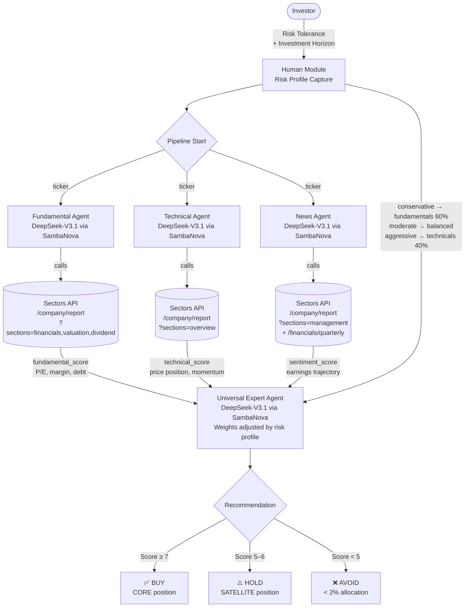

# Human-Agent Collaboration Framework for IDX Stock Analysis

> Source: https://docs.sectors.app/recipes/sectors-for-ai-agents/04-human-agent (verified 2026-08-29).
> By: [Alya Dwinanda](https://github.com/flytosevensky) · June 21, 2026.
> Inspired by [FinArena](https://arxiv.org/abs/2503.02692) (Xu et al., 2025) — adapted for the Indonesia Stock Exchange using Sectors Financial API and SambaNova's DeepSeek-V3.1.
>
> This is a stand-alone, deeper dive on top of the [Generative AI Python series](01-generative-ai-bg.md). It implements the "Human-Agent Collaboration" pattern from the FinArena paper: specialised agents for each data modality, then a **Universal Expert Agent** that synthesises them through the lens of the user's risk profile.

## Goal

Build a stock-analysis pipeline where the **investor's risk preference shapes the recommendation**, not just the underlying data. Three specialist agents (Fundamental, Technical, News) gather data independently, then a Universal Expert Agent weighs their signals differently based on whether the user is conservative, moderate, or aggressive.

The result: the same stock gets a different recommendation for a retiree vs. a growth trader — because the expert re-weights fundamentals vs. technicals vs. sentiment before producing its BUY/HOLD/AVOID verdict.

By the end you will have:

- Three specialist agents (Fundamental / Technical / News) each with a single tool.
- A `get_risk_profile()` function that captures risk tolerance + investment horizon upfront.
- A `build_expert_instructions()` function that constructs the Universal Expert's prompt with risk-specific weighting rules.
- An `analyze_stock(ticker, risk_profile)` pipeline that runs all three in parallel and synthesises the verdict.

---

## Architecture diagram



Five components:

1. **Human Module** — captures risk profile upfront. The investor's risk
   tolerance + investment horizon shape every downstream decision.
2. **Three Specialist Agents** — narrow, focused, single-tool. Each
   produces a JSON report card for one data modality.
3. **Sectors API** — the data backbone. Three different endpoint
   configurations, one per agent.
4. **Universal Expert Agent** — synthesises the three reports using
   risk-adjusted weights.
5. **Recommendation** — BUY/HOLD/AVOID + position sizing
   (CORE / SATELLITE / AVOID).

---

## Why FinArena? What's different from existing approaches

> "Most AI financial tools treat the investor as passive: you ask a
> question, the model answers. But real investment decisions are deeply
> personal — a retiree managing capital preservation thinks very differently
> from a growth-oriented analyst willing to tolerate volatility."
>
> — Alya Dwinanda, *Building a Human-Agent Collaboration Framework for IDX
> Stock Analysis*

The FinArena paper identifies three gaps in prior work:

### Problem 1: Existing tools use a single data type

Most AI stock analysis tools pick one lane — price history (LSTM / ARIMA /
transformer forecasters) **or** news sentiment **or** financial statements.
Very few do all three, and even fewer do it in a coordinated way.

FinArena's response is **specialist agents**, each optimised for one data
modality, then synthesised by a generalist. This is the same principle
behind Mixture of Experts (MoE) models: a router decides which expert
handles what, and each expert is highly tuned for its slice.

In the IDX adaptation, this maps naturally to Sectors API's endpoint
structure: fundamentals, price performance, and news/filings are separate
API calls, each handled by a dedicated agent.

### Problem 2: LLMs hallucinate on news data

When you ask a general LLM about recent corporate news, it may confidently
generate plausible-sounding but fabricated events — especially for
companies outside major markets like the US.

FinArena's solution is **Uncertainty-Driven Adaptive RAG** for the news
agent. Unlike naive RAG that always retrieves external context, the
adaptive version first checks whether the LLM is confident in its own
knowledge — and only fetches additional information when uncertain. This
reduces unnecessary retrieval calls and, more importantly, forces grounding
on factual data when it matters most.

In this implementation, Sectors API's actual filings and quarterly
financials serve as the ground truth source, not the LLM's training data.

### Problem 3: AI frameworks ignore the investor

FinArena's most distinctive critique of prior work. The paper calls it the
*"Human-Machine confrontation"* mindset — most research asks "can AI beat
human experts?" and optimises purely for prediction accuracy.

But accuracy on a benchmark is not the same as a good investment decision
**for you**. A stock that's a strong BUY for an aggressive growth investor
might be an AVOID for someone who can't stomach a 40% drawdown. Previous
multi-agent frameworks produced the same recommendation for every user.

FinArena reframes the goal: instead of replacing the investor, the system
**collaborates** with them. The human's risk preference isn't an
afterthought appended to the output — it's injected into the Expert
Agent's reasoning process, changing how it weights signals before
producing a recommendation.

### Comparison

|                          | Traditional AI Tools                          | FinArena Approach                                |
| ------------------------ | --------------------------------------------- | ------------------------------------------------ |
| **Data**                 | Single modality (price OR news OR statements) | All three, via specialist agents                 |
| **Hallucination control**| None or static RAG                            | Adaptive RAG, only when uncertain                |
| **Personalisation**      | One-size-fits-all output                      | Risk profile shapes the Expert Agent's reasoning |
| **Human role**           | Passive recipient                             | Active collaborator who sets decision context    |

---

## Step-by-step code walkthrough

### 1. Install dependencies

```bash
pip install requests nest_asyncio
```

### 2. Set up API keys

You need:

- A [Sectors API key](https://sectors.app) (Insider plan or hackathon
  onboarding).
- A [SambaNova API key](https://cloud.sambanova.ai) for the DeepSeek-V3.1
  LLM.

The recipe uses Kaggle's `UserSecretsClient` for portability, but any
key-loading mechanism works:

```python
# On Kaggle
from kaggle_secrets import UserSecretsClient

secrets = UserSecretsClient()
SECTORS_API_KEY = secrets.get_secret("SECTORS_API_KEY")
SAMBANOVA_API_KEY = secrets.get_secret("SAMBANOVA_API_KEY")

# Locally or in a notebook
# import os
# SECTORS_API_KEY = os.environ["SECTORS_API_KEY"]
# SAMBANOVA_API_KEY = os.environ["SAMBANOVA_API_KEY"]
```

### 3. Define the Sectors API tools

The four tool schemas (one per agent, plus a screener helper):

```python
import re, json, asyncio, requests, nest_asyncio

nest_asyncio.apply()

SECTORS_KEY = SECTORS_API_KEY
HEADERS = {"Authorization": SECTORS_KEY}
BASE = "https://api.sectors.app/v2"

SAMBANOVA_API_KEY = SAMBANOVA_API_KEY
SAMBANOVA_BASE_URL = "https://api.sambanova.ai/v1"
SAMBANOVA_MODEL_NAME = "DeepSeek-V3.1"

TOOL_SCHEMAS = {
    "get_fundamentals": {
        "type": "function",
        "function": {
            "name": "get_fundamentals",
            "description": "Fetch financial statements and valuation metrics for an IDX ticker.",
            "parameters": {
                "type": "object",
                "properties": {
                    "ticker": {"type": "string", "description": "Stock ticker (e.g., BBCA)"}
                },
                "required": ["ticker"]
            }
        }
    },
    "get_price_performance": {
        "type": "function",
        "function": {
            "name": "get_price_performance",
            "description": "Fetch recent price performance and trading statistics for an IDX ticker.",
            "parameters": {
                "type": "object",
                "properties": {
                    "ticker": {"type": "string", "description": "Stock ticker (e.g., BBCA)"}
                },
                "required": ["ticker"]
            }
        }
    },
    "get_news_and_filings": {
        "type": "function",
        "function": {
            "name": "get_news_and_filings",
            "description": "Fetch recent news and corporate filings for an IDX ticker.",
            "parameters": {
                "type": "object",
                "properties": {
                    "ticker": {"type": "string", "description": "Stock ticker (e.g., BBCA)"}
                },
                "required": ["ticker"]
            }
        }
    },
    "screen_by_sector": {
        "type": "function",
        "function": {
            "name": "screen_by_sector",
            "description": "Screen IDX companies by sector and minimum market cap (in billion IDR).",
            "parameters": {
                "type": "object",
                "properties": {
                    "sector": {"type": "string", "description": "Sector name (e.g., 'Basic Materials')"},
                    "min_market_cap_bn": {"type": "number", "description": "Minimum market cap in billion IDR"}
                },
                "required": ["sector", "min_market_cap_bn"]
            }
        }
    },
}
```

The agent runner — a small async loop that handles tool-calling
turns with SambaNova:

```python
async def run_agent(system_instruction: str, prompt: str, tools: list = None) -> str:
    """Run a SambaNova agent with function calling and return text output."""
    tool_map = {fn.__name__: fn for fn in (tools or [])}
    llm_tools = [TOOL_SCHEMAS[func.__name__] for func in tools if func.__name__ in TOOL_SCHEMAS] if tools else []
    headers = {
        "Authorization": f"Bearer {SAMBANOVA_API_KEY}",
        "Content-Type": "application/json"
    }
    messages = [
        {"role": "system", "content": system_instruction},
        {"role": "user", "content": prompt}
    ]
    loop = asyncio.get_running_loop()

    for _ in range(10):
        payload = {
            "model": SAMBANOVA_MODEL_NAME,
            "messages": messages,
            "temperature": 0,
            "stream": False
        }

        if llm_tools:
            payload["tools"] = llm_tools
            payload["tool_choice"] = "auto"

        def _sync_request():
            try:
                response = requests.post(f"{SAMBANOVA_BASE_URL}/chat/completions", headers=headers, json=payload)
                response.raise_for_status()
                return response.json()
            except requests.exceptions.RequestException as e:
                if e.response is not None:
                    print(f"Response Status: {e.response.status_code}")
                    print(f"Response Body: {e.response.text}")
                raise

        try:
            llm_response = await loop.run_in_executor(None, _sync_request)
        except Exception as e:
            return f"Error communicating with Sambanova API: {e}"

        if not llm_response or not llm_response.get('choices'):
            return f"Invalid or empty response from Sambanova: {llm_response}"

        first_choice = llm_response['choices'][0]
        message = first_choice.get('message', {})

        tool_calls = message.get('tool_calls')

        if not tool_calls:
            return message.get('content', '')

        messages.append(message)

        tool_outputs = []
        for tc in tool_calls:
            function_name = tc['function']['name']
            function_args = json.loads(tc['function']['arguments'])

            if function_name in tool_map:
                try:
                    result = tool_map[function_name](**function_args)
                    tool_outputs.append({
                        "tool_call_id": tc['id'],
                        "role": "tool",
                        "name": function_name,
                        "content": result
                    })
                except Exception as e:
                    tool_outputs.append({
                        "tool_call_id": tc['id'],
                        "role": "tool",
                        "name": function_name,
                        "content": f"Error executing tool {function_name}: {e}"
                    })
            else:
                tool_outputs.append({
                    "tool_call_id": tc['id'],
                    "role": "tool",
                    "name": function_name,
                    "content": f"Error: Tool {function_name} not found."
                })

        messages.extend(tool_outputs)

    return messages[-1].get('content', 'Max tool call rounds reached without final answer.')


def parse_json_response(text: str) -> dict:
    """Strip markdown code fences from LLM output, then parse as JSON."""
    if not text:
        raise ValueError("Empty response from model")
    clean = re.sub(r"^```(?:json)?\s*", "", text.strip(), flags=re.IGNORECASE)
    clean = re.sub(r"\s*```$", "", clean.strip())
    return json.loads(clean.strip())
```

The four tool implementations — thin wrappers around Sectors REST endpoints:

```python
def get_fundamentals(ticker: str) -> str:
    """Fetch financial statements and valuation metrics for an IDX ticker."""
    url = f"{BASE}/company/report/{ticker}/?sections=financials,valuation,dividend"
    resp = requests.get(url, headers=HEADERS)
    resp.raise_for_status()
    return json.dumps(resp.json())

def get_price_performance(ticker: str) -> str:
    """Fetch recent price performance and trading statistics for an IDX ticker."""
    url = f"{BASE}/company/report/{ticker}/?sections=overview"
    resp = requests.get(url, headers=HEADERS)
    resp.raise_for_status()
    return json.dumps(resp.json())

def get_news_and_filings(ticker: str) -> str:
    """Fetch recent news and corporate filings for an IDX ticker."""
    url = f"{BASE}/company/report/{ticker}/?sections=management"
    resp = requests.get(url, headers=HEADERS)
    resp.raise_for_status()

    url_q = f"{BASE}/financials/quarterly/{ticker}/?n_quarters=4"
    resp_q = requests.get(url_q, headers=HEADERS)

    result = {
        "management": resp.json(),
        "quarterly_financials": resp_q.json() if resp_q.ok else {}
    }
    return json.dumps(result)
```

> **Equivalent MCP tools** (see [`../mcp/tools.md`](../mcp/tools.md)):
> - `get_fundamentals` → `fetch-company-report(symbol, sections="financials,valuation,dividend")`
> - `get_price_performance` → `fetch-company-report(symbol, sections="overview")`
> - `get_news_and_filings` → `fetch-company-report(symbol, sections="management")` + `fetch-quarterly-financials(symbol, n_quarters=4)`

### 4. The Human Module — capture risk preference upfront

```python
def get_risk_profile() -> dict:
    """Interactively capture the investor's risk preference."""
    print("\n=== FinArena: IDX Investment Analysis ===")
    print("Before we begin, tell us about your investment profile.\n")

    print("Risk Tolerance:")
    print("  [1] Conservative — Capital preservation, low volatility, prefer dividends")
    print("  [2] Moderate     — Balanced growth and income, some volatility acceptable")
    print("  [3] Aggressive   — Maximum growth, high volatility acceptable\n")

    choice = input("Enter your risk tolerance (1/2/3): ").strip()
    risk_map = {"1": "conservative", "2": "moderate", "3": "aggressive"}
    risk = risk_map.get(choice, "moderate")

    horizon = input("Investment horizon in years (e.g. 1, 3, 5, 10): ").strip()

    print(f"\nProfile set: {risk.upper()} investor, {horizon}-year horizon.\n")
    return {"risk_tolerance": risk, "horizon_years": horizon}
```

Example interaction:

```
=== FinArena: IDX Investment Analysis ===
Before we begin, tell us about your investment profile.

Risk Tolerance:
  [1] Conservative — Capital preservation, low volatility, prefer dividends
  [2] Moderate     — Balanced growth and income, some volatility acceptable
  [3] Aggressive   — Maximum growth, high volatility acceptable

Enter your risk tolerance (1/2/3): 1
Investment horizon in years (e.g. 1, 3, 5, 10): 5

Profile set: CONSERVATIVE investor, 5-year horizon.
```

### 5. The three Specialist Agents

Each agent has a narrow mandate and a single tool. Narrow focus reduces
hallucinations and keeps reasoning traceable.

```python
FUNDAMENTAL_INSTRUCTIONS = (
    "You are a fundamental equity analyst specializing in the Indonesia Stock Exchange (IDX). "
    "Use the get_fundamentals tool to retrieve financial data for the given ticker. "
    "Summarize: revenue trend, net profit margin, P/E ratio, P/B ratio, dividend yield, "
    "and debt-to-equity. Flag any red flags (negative margins, high leverage, etc). "
    "Output a JSON object with keys: ticker, revenue_trend, profitability, valuation, "
    "dividend_yield, leverage, red_flags, fundamental_score (1-10)."
)

TECHNICAL_INSTRUCTIONS = (
    "You are a technical analyst specializing in IDX price action. "
    "Use get_price_performance to retrieve price and market data for the given ticker. "
    "Analyze: 52-week price range position, market cap trend, beta (if available), "
    "and recent trading momentum. "
    "Output a JSON object with keys: ticker, price_position, momentum, market_cap, "
    "volatility_signal, technical_score (1-10)."
)

NEWS_INSTRUCTIONS = (
    "You are a news and sentiment analyst for IDX equities. "
    "Use get_news_and_filings to retrieve recent management info and quarterly financials. "
    "Look for: earnings trajectory (last 4 quarters), management changes, and any notable "
    "corporate actions. Assess whether momentum is positive, neutral, or negative. "
    "Output a JSON object with keys: ticker, earnings_trajectory, management_notes, "
    "corporate_actions, sentiment (positive/neutral/negative), sentiment_score (1-10)."
)
```

### 6. The Universal Expert Agent

The synthesis layer. It reads all three specialist reports alongside the
investor's risk profile and produces a final, personalised recommendation.
This mirrors FinArena's "universal expert agent" that combines multimodal
signals with user preferences.

```python
def build_expert_instructions(risk_profile: dict) -> str:
    risk = risk_profile["risk_tolerance"]
    horizon = risk_profile["horizon_years"]

    weight_instructions = {
        "conservative": (
            "Weight fundamentals (60%) > sentiment (25%) > technicals (15%). "
            "Prioritize dividend yield, low debt, and stable earnings over growth. "
            "Downgrade any stock with a fundamental_score below 6 or negative sentiment."
        ),
        "moderate": (
            "Weight fundamentals (40%) > technicals (35%) > sentiment (25%). "
            "Balance growth and income. Accept moderate volatility if fundamentals are strong."
        ),
        "aggressive": (
            "Weight technicals (40%) > fundamentals (35%) > sentiment (25%). "
            "Prioritize momentum and growth potential. Higher risk is acceptable for higher return."
        ),
    }

    return (
        f"You are a senior investment advisor synthesizing research for a {risk.upper()} investor "
        f"with a {horizon}-year horizon on the Indonesia Stock Exchange (IDX).\n\n"
        f"Weighting framework for this investor profile:\n{weight_instructions[risk]}\n\n"
        "You will receive three JSON reports: fundamental, technical, and sentiment analysis. "
        "Combine them into a final investment recommendation with:\n"
        "- Overall score (1-10)\n"
        "- Recommendation: BUY / HOLD / AVOID\n"
        "- Key reasons (3 bullet points)\n"
        "- Risk warnings specific to this investor's profile\n"
        "- Suggested position sizing: CORE (>5%), SATELLITE (2-5%), or AVOID (<2%)\n\n"
        "Format your output as clean JSON with keys: ticker, overall_score, recommendation, "
        "key_reasons, risk_warnings, position_sizing, summary."
    )
```

The risk-specific weighting rules are the heart of the framework:

| Risk profile   | Fundamentals | Technicals | Sentiment | Downgrade rules                                  |
| -------------- | ------------ | ---------- | --------- | ------------------------------------------------ |
| **Conservative** | 60%          | 15%        | 25%       | Downgrade if fundamental_score < 6 OR negative sentiment |
| **Moderate**   | 40%          | 35%        | 25%       | Balance growth and income                         |
| **Aggressive** | 35%          | 40%        | 25%       | Prioritise momentum and growth                    |

### 7. Orchestrate the full pipeline

```python
async def analyze_stock(ticker: str, risk_profile: dict) -> dict:
    """Run the full FinArena pipeline for a single IDX ticker."""
    print(f"\nAnalyzing {ticker}...")

    # Run the three specialist agents concurrently
    fundamental_task = run_agent(
        FUNDAMENTAL_INSTRUCTIONS, f"Analyze ticker: {ticker}", [get_fundamentals]
    )
    technical_task = run_agent(
        TECHNICAL_INSTRUCTIONS, f"Analyze ticker: {ticker}", [get_price_performance]
    )
    news_task = run_agent(
        NEWS_INSTRUCTIONS, f"Analyze ticker: {ticker}", [get_news_and_filings]
    )

    fundamental_result, technical_result, news_result = await asyncio.gather(
        fundamental_task, technical_task, news_task
    )

    print(f"  Fundamental: done | Technical: done | News: done")

    # Synthesize with the Universal Expert Agent
    expert_instructions = build_expert_instructions(risk_profile)
    synthesis_prompt = (
        f"Ticker: {ticker}\n\n"
        f"=== FUNDAMENTAL REPORT ===\n{fundamental_result}\n\n"
        f"=== TECHNICAL REPORT ===\n{technical_result}\n\n"
        f"=== NEWS & SENTIMENT REPORT ===\n{news_result}\n\n"
        "Synthesize these three reports into your final recommendation."
    )

    expert_result = await run_agent(expert_instructions, synthesis_prompt)
    return parse_json_response(expert_result)


RECOMMENDATION_EMOJI = {"BUY": "✅", "HOLD": "⚠️", "AVOID": "❌"}

async def main():
    import pandas as pd
    from IPython.display import display

    # Step 1: Capture human input
    risk_profile = get_risk_profile()

    # Step 2: Define your watchlist
    watchlist = ["BBCA", "TLKM", "ASII"]

    # Step 3: Analyze each stock
    recommendations = []
    for ticker in watchlist:
        result = await analyze_stock(ticker, risk_profile)
        recommendations.append(result)

    # Step 4: Display as table
    sorted_recs = sorted(recommendations, key=lambda x: x["overall_score"], reverse=True)

    rows = []
    for rec in sorted_recs:
        emoji = RECOMMENDATION_EMOJI.get(rec["recommendation"], "")
        reasons = "\n".join(f"• {r}" for r in rec["key_reasons"])
        rows.append({
            "Ticker":         rec["ticker"],
            "Score":          f"{rec['overall_score']}/10",
            "Recommendation": f"{emoji} {rec['recommendation']}",
            "Position":       rec["position_sizing"],
            "Key Reasons":    reasons,
            "Risk Warnings":  rec["risk_warnings"],
        })

    df = pd.DataFrame(rows)

    print(f"\nFinArena Analysis — {risk_profile['risk_tolerance'].upper()} Investor "
          f"| Horizon: {risk_profile['horizon_years']} years\n")

    pd.set_option("display.max_colwidth", 80)
    pd.set_option("display.colheader_justify", "left")
    display(df.set_index("Ticker"))

    return recommendations


# In a notebook / Kaggle:
await main()
```

---

## Sample output

For a **Conservative investor** analyzing BBCA, TLKM, and ASII (from the
recipe's worked example):

```
=== FinArena: IDX Investment Analysis ===
Before we begin, tell us about your investment profile.

Risk Tolerance:
  [1] Conservative — Capital preservation, low volatility, prefer dividends
  [2] Moderate     — Balanced growth and income, some volatility acceptable
  [3] Aggressive   — Maximum growth, high volatility acceptable

Enter your risk tolerance (1/2/3):  1
Investment horizon in years (e.g. 1, 3, 5, 10):  1

Profile set: CONSERVATIVE investor, 1-year horizon.

Analyzing BBCA...
  Fundamental: done | Technical: done | News: done
Analyzing TLKM...
  Fundamental: done | Technical: done | News: done
Analyzing ASII...
  Fundamental: done | Technical: done | News: done

FinArena Analysis — CONSERVATIVE Investor | Horizon: 1 years
```

| Ticker | Score     | Recommendation    | Position   | Key reasons                                                                                          | Risk warnings                                                                                |
| ------ | --------- | ----------------- | ---------- | ---------------------------------------------------------------------------------------------------- | -------------------------------------------------------------------------------------------- |
| BBCA   | 8.0/10    | ✅ BUY            | CORE       | 51.4% net margin, 20.4% ROE, conservative leverage; stable 5.5% dividend yield                        | Premium valuation (P/B 3.0x vs peer avg 0.75x); LDR 75.9% near regulatory limit           |
| TLKM   | 6.0/10    | ⚠️ HOLD           | SATELLITE  | 7.3% dividend yield with consistent payouts; reasonable P/E 15.6x, P/B 1.9x                            | Stock near 52-week lows (-35%); -24.7% EPS growth; high volatility                            |
| ASII   | 6.5/10    | ⚠️ HOLD           | SATELLITE  | 8.18% dividend yield; sustainable payout 49.7%; attractive P/E 6.15x, P/B 0.84x                       | Revenue -5.6% YoY; Q1 2026 earnings drop; negative cash flow / debt ratio -0.39x            |

Sample expert JSON for BBCA:

```json
{
  "ticker": "BBCA",
  "overall_score": 8,
  "recommendation": "BUY",
  "key_reasons": [
    "Exceptional fundamental strength with 51.4% net profit margin, 20.4% ROE, and conservative leverage (debt-to-equity 4.6x) supporting stable dividend yield of 5.5%",
    "Strong market leadership position as Indonesia's largest bank by market cap with consistent revenue growth and robust capital adequacy ratio of 30.4%",
    "Positive earnings trajectory and stable management team with strong operating cash flow generation and asset growth"
  ],
  "risk_warnings": [
    "Premium valuation (P/B 3.0x vs peer avg 0.75x) may limit upside potential in conservative portfolio context",
    "Loan-to-deposit ratio of 75.9% approaching regulatory limits requires monitoring",
    "Moderate volatility and mid-range price position (56.8% of 52-week range) may not suit ultra-conservative short-term horizon"
  ],
  "position_sizing": "CORE",
  "summary": "BBCA represents a high-quality conservative investment with strong fundamentals, attractive dividend yield, and market leadership position. While trading at a premium valuation, its exceptional profitability, conservative leverage, and stable earnings make it suitable for core portfolio allocation despite some monitoring requirements on lending ratios."
}
```

---

## Inputs / outputs

- **Input**: ticker symbol + risk profile (interactive: risk tolerance 1/2/3
  + horizon in years).
- **Output**: per-ticker `{overall_score, recommendation, key_reasons,
  risk_warnings, position_sizing, summary}` JSON + a pandas DataFrame
  summary.

---

## Excel export extension

The recipe extends the result with a one-line Excel export:

```python
import pandas as pd

RECOMMENDATION_EMOJI = {"BUY": "✅", "HOLD": "⚠️", "AVOID": "❌"}

for rec in current_recommendations:
    emoji = RECOMMENDATION_EMOJI.get(rec["recommendation"], "")
    reasons = "\n".join(f"• {r}" for r in rec["key_reasons"])
    rows_for_excel.append({
        "Ticker":         rec["ticker"],
        "Score":          f"{rec['overall_score']}/10",
        "Recommendation": f"{emoji} {rec['recommendation']}",
        "Position":       rec["position_sizing"],
        "Key Reasons":    reasons,
        "Risk Warnings":  rec["risk_warnings"],
        "Summary":        rec.get("summary", "")
    })

df_excel = pd.DataFrame(rows_for_excel)
df_excel.to_excel("investment_recommendations.xlsx", index=False)
```

---

## Why this is different from recipe 03

Recipe 03 is a **judge-critic loop** over a generic screener. This
recipe is a **Human-Agent Collaboration** with three key differences:

1. **Risk profile is an input, not an afterthought**. Recipe 03's
   Evaluator scores against objective rules. This recipe's Universal
   Expert re-weights signals based on the user's risk tolerance and
   horizon. The same underlying data → different verdicts for different
   users.
2. **Three specialists, not one screener**. Recipe 03's Researcher does
   everything (overview + financials + valuation). This recipe splits
   into Fundamental / Technical / News, each focused on one data
   modality. The synthesis is the Expert's job.
3. **Position sizing is a first-class output**. Not just BUY/HOLD/AVOID,
   but CORE / SATELLITE / AVOID. Aligns with how real portfolio managers
   think.

---

## Hackathon applicability

| Track                  | How this recipe applies                                         |
| ---------------------- | --------------------------------------------------------------- |
| **AI agents**          | The richest agent pattern in the series. Use this when "one-size-fits-all" recommendations are not enough. |
| **Automation**         | Wrap `get_risk_profile()` in a CLI flag, run `analyze_stock` nightly for each user's watchlist. |
| **Market intelligence** | A personalised market briefing: every morning, every user gets a re-ranked recommendation set based on their risk profile. |

---

## Pitfalls

- **Don't hardcode the risk weights outside `build_expert_instructions`**.
  They're the whole point of the framework. Keep them centralised.
- **Don't use a non-finance-tuned LLM for the Universal Expert**. The
  Expert's job is to *judge* the three specialist reports. A general LLM
  will lose nuance. DeepSeek-V3.1 via SambaNova is the recipe's choice for
  its reasoning depth; if you swap to a smaller model, watch for
  position-sizing drift (CORE → SATELLITE) on borderline cases.
- **Don't call the three specialist agents sequentially**. They are
  independent — use `asyncio.gather(...)` to run them concurrently. The
  recipe's speed comes from this parallelisation.
- **Don't treat the JSON contract as advisory**. If a specialist agent
  omits a required field (e.g. `fundamental_score`), the Expert has
  nothing to weight. Either fix the system prompt or add a retry loop.
- **Don't run this on a free-tier SambaNova key for production**. Rate
  limits bite hard at three concurrent agents + one expert per stock.
  Pre-aggregate or batch.
- **Don't skip the `parse_json_response` fence-stripping**. LLMs
  frequently wrap JSON in ```json ... ``` blocks; `re.sub` strips the
  fences before `json.loads` to avoid the parse error.

---

## Reference

> Xu, C., Liu, Z., & Li, Z. (2025). [FinArena: A Human-Agent Collaboration
> Framework for Financial Market Analysis and Forecasting](https://arxiv.org/abs/2503.02692).
> arXiv:2503.02692.

---

## Next steps

- [Recipe 03 — Multi-agent workflows](03-multiagent.md) — judge-critic
  pattern over a generic screener (alternative to FinArena's risk-aware
  weighting).
- [Recipe 05 — Tool-use ReAct with streaming](05-react-conversational.md)
  — modern LangGraph agent stack.
- [Recipe 06 — Conversational memory](06-memory-agents.md) — combine
  with FinArena to remember a user's risk profile + prior analyses.
- [`../mcp/tools.md`](../mcp/tools.md) — full Sectors MCP tool catalog.
